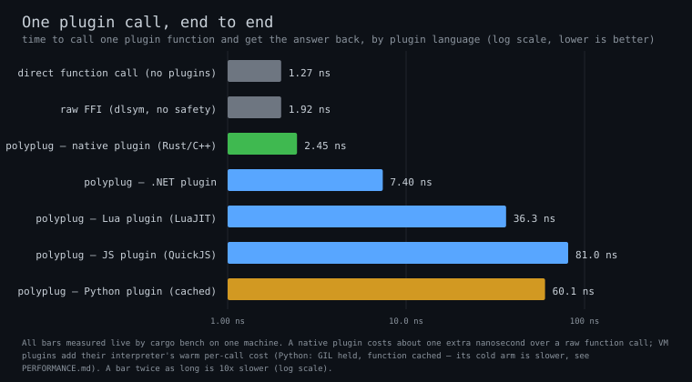

# polyplug

**A blazing-fast, zero-overhead, cross-language, cross-platform plugin runtime — load real plugins written in any of six languages (Rust, C++, C#, Python, Lua, JavaScript) through a frozen C ABI.**

You build both sides of an extensible application — the host app and its plugins — in any of the six languages, in any combination, talking over a frozen C ABI with near-native dispatch (~2.4 ns/call for native languages). A Rust host can load a Python plugin; a Bun host can load a C++ plugin; any host language pairs with any guest language — a full 6×6 matrix. Plugins run as real native code or real language runtimes (CPython, the .NET CLR, LuaJIT, QuickJS) — not compiled to WebAssembly — so you keep zero-copy data sharing and language-native behavior at native speed.

> One plugin call, end to end — **lower is better**, log scale. Measured locally from live benchmark runs; see [Performance](docs/PERFORMANCE.md#how-to-read-these-charts) for how to read these charts.

## No sandbox, by design — vet the author, not the runtime

polyplug runs plugins **in-process, with no isolation boundary — a deliberate trade.** That single choice is what turns a plugin call into a direct function-pointer dispatch with zero-copy data sharing, instead of a marshalled hop across a sandbox — and it is where the speed comes from. So trust is established when you *load* a bundle (you vetted the author; a signature proves the bytes weren't tampered with), not re-checked on every call. It is the same model the most successful native-extension ecosystems use — e.g. VS Code extensions: vet the author, not the sandbox.

Today, if you need to run arbitrary untrusted code, reach for a WebAssembly runtime (Extism, Wasmtime) — and we'll say so plainly. The full threat model is in the [Trust Model](docs/TRUST_MODEL.md).

## What polyplug guarantees

Within the trusted, in-process boundary, polyplug still makes hard guarantees:

- **ABI compatibility is checked at load** — a bundle whose contract version doesn't match is rejected with a clear error, never silent UB.
- **The runtime's create/destroy path is crash-isolated** — a bug in polyplug's two C ABI exports surfaces as a null/no-op plus a recorded error, never a host abort.
- **Lock-free reads and safe true-unload** — contract resolution serves from an epoch-published snapshot; unloading reclaims the interface and the backing library/VM once no reader is still pinned (model-checked with [loom](https://docs.rs/loom)).
- **Bundle identity and integrity** — a bundle can carry a detached Ed25519 signature over a canonical digest of every file it contains, with a host-chosen `SignaturePolicy` from TOFU integrity up to pinned-key authenticity. This proves *who* authored a bundle and that it wasn't tampered with — it is identity, not isolation.

## Six languages, host and guest

Each language is a first-class **host** (embed the runtime, load and call plugins) and a first-class **guest** (write a plugin other apps load). Pick per side independently.

| Language | Guide |
|---|---|
| Rust | [docs/languages/rust.md](docs/languages/rust.md) |
| C++ | [docs/languages/cpp.md](docs/languages/cpp.md) |
| C# | [docs/languages/csharp.md](docs/languages/csharp.md) |
| Python | [docs/languages/python.md](docs/languages/python.md) |
| Lua | [docs/languages/lua.md](docs/languages/lua.md) |
| JavaScript | [docs/languages/js.md](docs/languages/js.md) |

## Where to go next

- **New here?** Start with the [Quick Start](docs/QUICKSTART.md) and write your first plugin in 10 minutes.
- **Picking a language?** Browse the per-language guides above — each has a host and a guest walkthrough.
- **Embedding polyplug?** Read the [Architecture Overview](docs/ARCHITECTURE.md).
- **Weighing the trade-off?** Read the [Trust Model](docs/TRUST_MODEL.md).
- **Reading the whole book?** The full docs tree is published at <https://polyplug.github.io/polyplug/>, built from `docs/` with mdBook.

## Status

Published to crates.io, PyPI, NuGet, LuaRocks, npm, and JSR. The ABI is **pre-1.0** — ABI-visible changes are permitted between releases (see the [Trust Model](docs/TRUST_MODEL.md)). The full test suite runs on Linux, macOS, and Windows.

Found a vulnerability? Report it privately — see [SECURITY.md](SECURITY.md). Please don't open a public issue.

## License

MIT License — see [LICENSE](LICENSE) for details.
