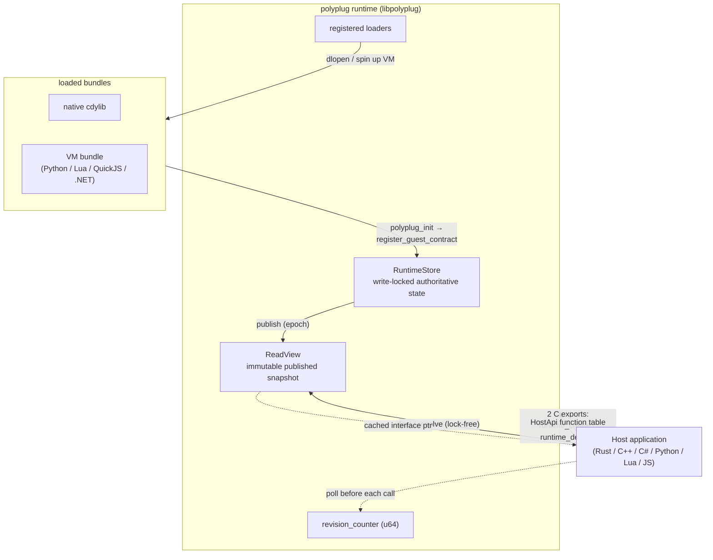
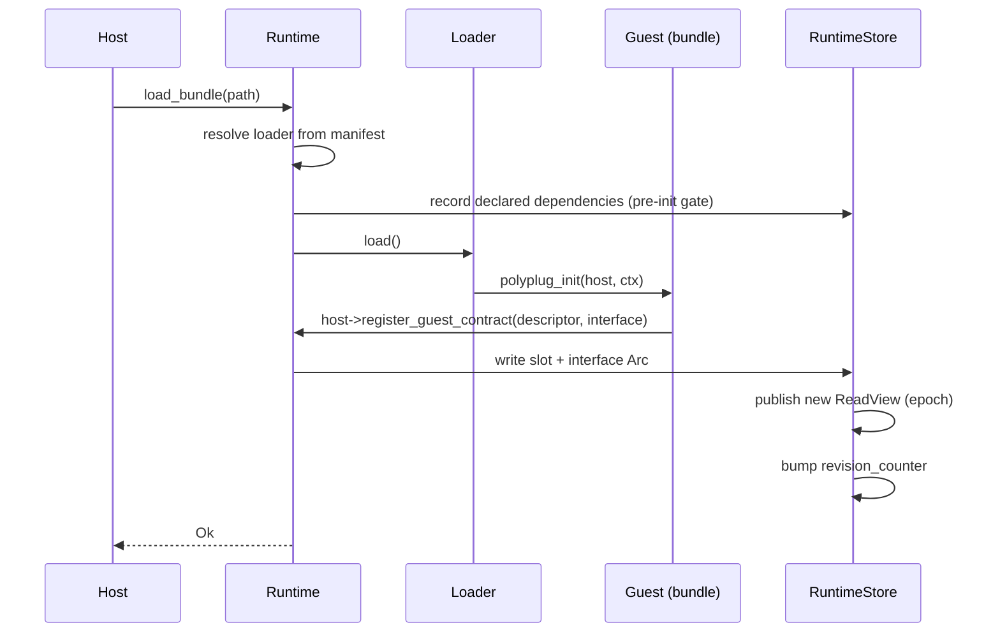
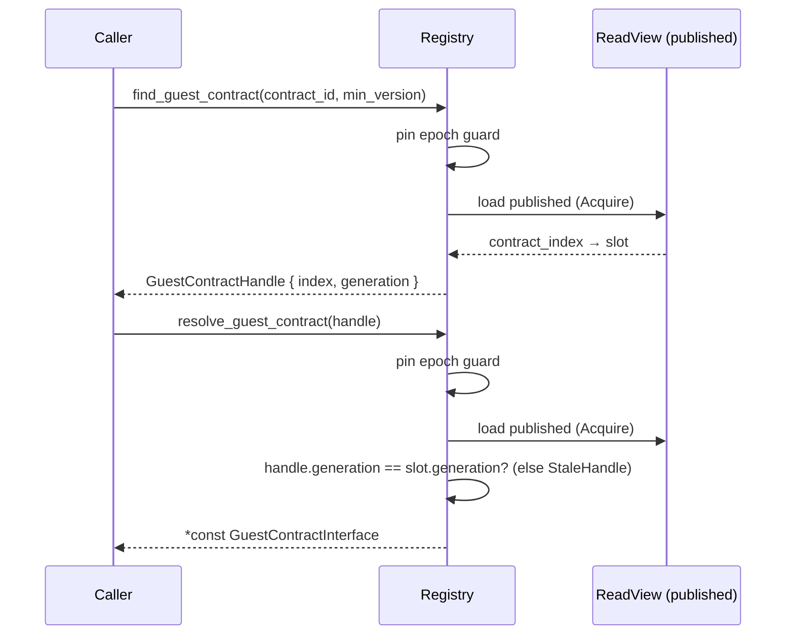
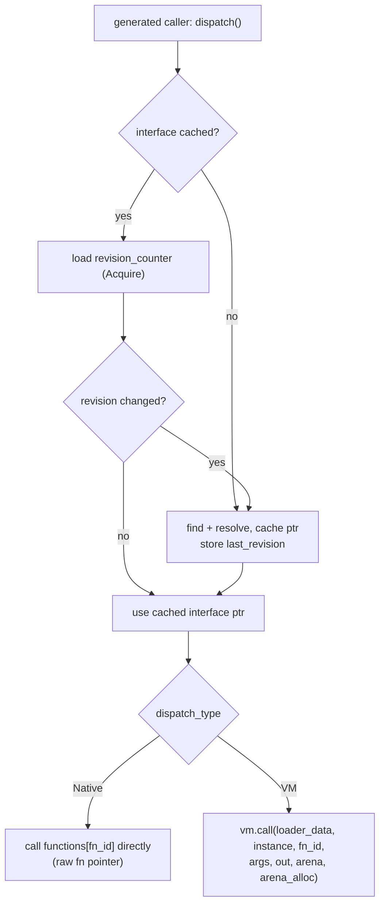
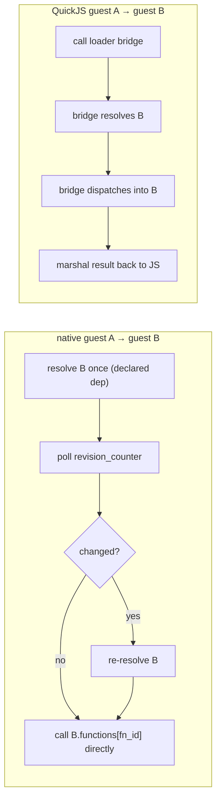
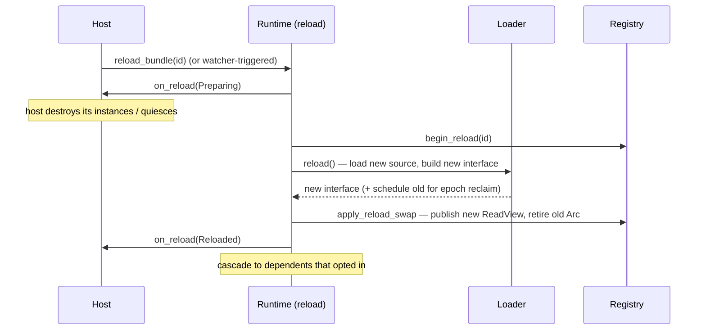
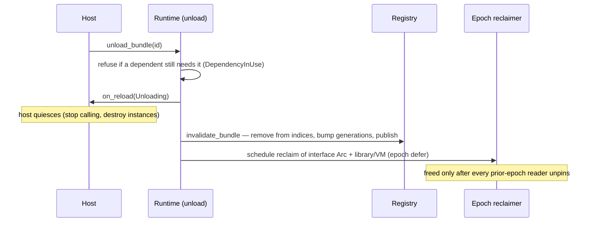

# Architecture — runtime pipelines

A visual tour of how polyplug works **at runtime**: how a bundle is loaded, how a
host calls a guest, how a guest calls another guest, how the loaders differ, and
how hot-reload and unload stay safe under concurrent calls.

This document is the map. For the authoritative details of any one area, follow
the cross-links to the deep-dive docs:

| Area | Deep dive |
|---|---|
| ABI surface, `polyplug_init`, `HostApi` self-passing | [`ABI_ARCHITECTURE.md`](ABI_ARCHITECTURE.md) |
| `GuestContractInterface`, native vs VM dispatch | [`PLUGIN_INTERFACE_DESIGN.md`](PLUGIN_INTERFACE_DESIGN.md) |
| Bundle identity, declared dependencies, peer-call safety | [`TRUST_MODEL.md`](TRUST_MODEL.md) |
| Hot-reload phases and the safety window | [`HOT_RELOAD_DESIGN.md`](HOT_RELOAD_DESIGN.md), [`RELOAD_LIMITATIONS.md`](RELOAD_LIMITATIONS.md) |
| Unload, epoch reclamation, dependency refusal | [`UNLOAD_DESIGN.md`](UNLOAD_DESIGN.md) |
| Shipped-feature overview | [`FEATURES.md`](FEATURES.md) |

> Diagrams reference source **files**, not line numbers, so they don't rot. The
> deep-dive docs carry the line-level detail.

---

## The big picture

A host application embeds the `polyplug` runtime, registers one loader per plugin
language it wants to support, and loads bundles. Each bundle registers one or more
**guest contracts**; the host discovers and calls them through a frozen C ABI.

The host-side library exposes exactly **two** `#[no_mangle]` C symbols —
`polyplug_runtime_create` and `polyplug_runtime_destroy`. Everything else is a
field on the `HostApi` struct (a frozen 184-byte function table). See
[`ABI_ARCHITECTURE.md`](ABI_ARCHITECTURE.md) for the full surface.

---

## Pipeline 1 — bundle load and registration

`Runtime::load_bundle` selects a loader by the manifest's loader name, records the
bundle's **declared dependencies** *before* running the bundle (so a guest can only
resolve what it declared — see [`TRUST_MODEL.md`](TRUST_MODEL.md)), then runs the
bundle's entry point. The guest registers each contract back through the `HostApi`,
and the runtime publishes a fresh immutable snapshot.

`register_guest_contract` uses the **self-passing** pattern
`host->register_guest_contract(host, &descriptor, &interface)` — identical across
every language generator (a hard rule; see `CLAUDE.md` §10).

---

## Pipeline 2 — lock-free registry read

Resolution (`find` / `resolve`) never takes a lock. A reader pins a
crossbeam-epoch guard, loads the published `ReadView` with an acquire load, and
serves directly from the immutable snapshot. The pin keeps that snapshot (and the
`Arc<GuestContractInterface>` inside it) alive for as long as the reader holds it —
which is what makes concurrent reload/unload safe (Pipelines 6–7).

The **generation** check is how a handle to an unloaded/reloaded contract is
rejected instead of dereferencing freed memory.

---

## Pipeline 3 — host → guest dispatch (self-revalidating caller)

Generated host callers resolve the interface **once** and cache it. Before each
dispatch they do a single acquire-load of `HostApi.revision_counter` and compare it
to the last value they saw. Unchanged → use the cached pointer (no re-resolve, no
lock). Changed (something was loaded/reloaded/unloaded) → re-resolve transparently.
A cached pointer therefore can never dangle.

- **Native dispatch** (Rust/C++/C# guests as cdylib): a direct call through the
  function-pointer table — near-zero overhead.
- **VM dispatch** (Python/Lua/QuickJS guests): the call goes through the loader's
  dispatch function, threading a **per-call arena** allocator as an explicit
  argument (no shared/global arena — see `CLAUDE.md` §12).

**Instance lifecycle.** Constructing and destroying a guest instance is
host-mediated: `create_guest_instance` / `destroy_guest_instance` pin the epoch
across the whole operation and attribute each live instance to its contract, so an
unload can't reclaim an interface mid-construction. See
[`FEATURES.md`](FEATURES.md).

---

## Pipeline 4 — plugin calls plugin (peer dispatch)

A guest can call another guest it declared a dependency on. For native languages
this is a **direct** call through the cached interface — the same fast path as a
host caller, with no round-trip back into the runtime and no per-call epoch pin.
QuickJS can't dereference raw pointers, so JS peer calls go through the loader's
bridge, which resolves and dispatches on the guest's behalf.

**Why direct peer calls are safe without a per-call pin:**

1. **Dependency refusal** — the runtime refuses to unload B while A still depends
   on it (a `DependencyInUse` error), so B's interface can't vanish underneath A.
2. **Immutable interface** — a registered `GuestContractInterface` is never mutated
   in place.
3. **Reload revalidation** — the revision-counter poll before each dispatch catches
   a *reload* of B and forces a re-resolve.

The `call_guest_method` HostApi field that earlier versions used for cross-contract
calls is **gone**; peer calls now use the same find/resolve + dispatch path as host
callers. See [`TRUST_MODEL.md`](TRUST_MODEL.md) and [`UNLOAD_DESIGN.md`](UNLOAD_DESIGN.md).

---

## Pipeline 5 — how the loaders work

There are two loader families. Both present the **same** C ABI to the runtime; they
differ only in where the `polyplug_init` symbol lives.

```mermaid
flowchart TB
    subgraph A["Native cdylib loader"]
        N1["dlopen the .so / .dylib / .dll"] --> N2["resolve C symbol polyplug_init"]
        N2 --> N3["call polyplug_init(host, ctx)"]
        N3 --> N4["guest calls register_guest_contract directly"]
    end

    subgraph B["VM trampoline loader (Python / Lua / QuickJS / .NET)"]
        V1["spin up a per-bundle VM"] --> V2["run the guest source"]
        V2 --> V3["guest text RETURNS (registrations, abi_error)<br/>— nothing in globals"]
        V3 --> V4["Rust trampoline (it owns the C polyplug_init symbol)"]
        V4 --> V5["trampoline calls register_guest_contract per registration"]
    end
```

For VM guests the C-ABI surface (`polyplug_init`, `register_guest_contract`) is
presented by the **Rust loader trampoline**, not the guest text. The guest never
writes the C signature: it returns its registrations and the trampoline drives the
ABI. The `HostApi` pointer and per-call arena are threaded as explicit arguments,
and QuickJS additionally gets a `bridge` object (memory accessors + host-contract
caller) — no VM globals anywhere (`CLAUDE.md` §10/§12).

| Loader | Mechanism | Hot-reload | Isolation note |
|---|---|---|---|
| native (`polyplug_native`) | dlopen cdylib | ✅ | full per-bundle |
| Lua (`polyplug_lua`) | per-bundle LuaJIT VM | ✅ | full per-bundle |
| JS (`polyplug_js`) | per-bundle QuickJS VM + bridge | ✅ | full per-bundle |
| Python (`polyplug_python`) | CPython + per-bundle module isolation | ❌ `HotReloadDisabled` | CPython is once-per-process |
| .NET (`polyplug_dotnet`) | collectible `AssemblyLoadContext` per bundle | ❌ `HotReloadDisabled` | CLR is once-per-process |

---

## Pipeline 6 — hot-reload

Reload re-reads the on-disk source, builds a fresh interface, and **swaps** it into
the live slot by publishing a new `ReadView`. The superseded interface `Arc` and
the old dylib/VM are handed to **epoch-deferred reclamation** — not freed
immediately. A reader pinned before the swap keeps the old interface *and its
still-mapped library* alive until it unpins.

Phases are `Preparing → Reloaded` (or `Failed`). The host must stop calling during
the window it's told to — the *quiesce contract*. Native/Lua/JS support reload;
Python/.NET return `HotReloadDisabled`. See
[`HOT_RELOAD_DESIGN.md`](HOT_RELOAD_DESIGN.md) and
[`RELOAD_LIMITATIONS.md`](RELOAD_LIMITATIONS.md).

---

## Pipeline 7 — unload and epoch reclamation

Unload removes the bundle from the registry (bumping generations so existing
handles go stale), then reclaims the interface **and** the backing library/VM once
no reader is still pinned in the prior epoch. The runtime is structurally blind to
in-flight raw native calls and raw VM-state pointers, so immediate `dlclose`/VM-drop
would be a use-after-free — epoch deferral is what makes it sound.

Per-language teardown once reclamation fires: native/Lua/JS free the library/VM;
Python purges its module cache; .NET unloads the collectible `AssemblyLoadContext`.
A raw interface pointer cached and used *after* its bundle is unloaded is documented
undefined behaviour — the host must quiesce first. See
[`UNLOAD_DESIGN.md`](UNLOAD_DESIGN.md).

---

## Concurrency model in one paragraph

Reads are lock-free: every reader serves from an immutable, epoch-published
`ReadView`. Writers (load / reload / unload) mutate the locked `RuntimeStore`, then
atomically publish a new snapshot and bump the `revision_counter`. Superseded
snapshots, interface `Arc`s, and dylibs/VMs are reclaimed through crossbeam-epoch
deferral, so memory is freed only once no reader can still observe it. Generated
callers cache the resolved interface and revalidate with a single acquire-load of
the revision counter before each dispatch — giving near-native call cost with no
dangling pointers across reloads. The epoch publish/reclaim protocol is
model-checked with [loom](https://docs.rs/loom).
