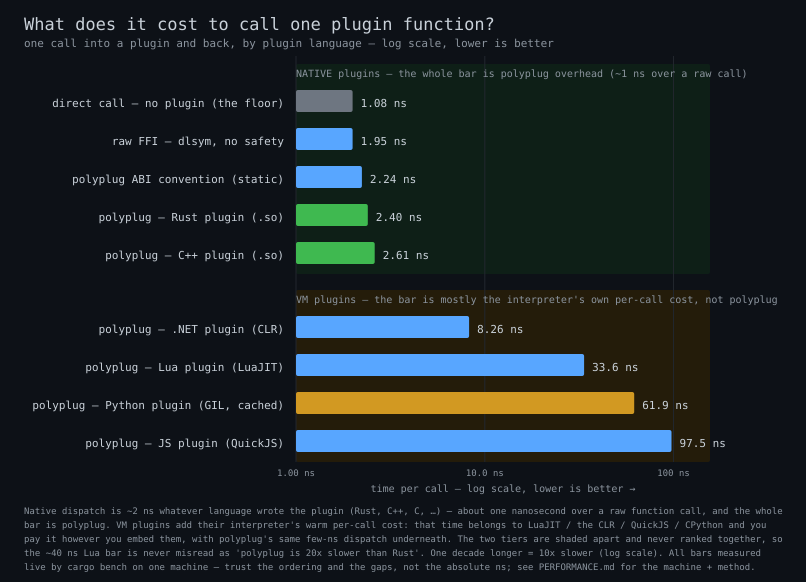

# polyplug Performance Guide

See [../glossary.md](glossary.md) for the canonical terms used here (HostApi,
GuestContractInterface, arena, epoch, revision counter, and the rest).

## Hot path call flow

polyplug is **blazing-fast by construction** — built for **zero-overhead, native-speed hot path calls**. The architecture ensures:

1. **Resolve once** - Find the contract handle, then resolve it to an interface pointer
2. **Cache the pointer** - The resolved `*const GuestContractInterface` stays valid while the bundle is loaded
3. **One indirect call** - Dispatch to the plugin function

```text
┌─────────────────────────────────────────────────────────────────┐
│                    HOT PATH CALL FLOW                            │
├─────────────────────────────────────────────────────────────────┤
│                                                                  │
│   Setup (once per contract):                                     │
│   1. Runtime.find_guest_contract(contract_id, min_version)       │
│      └─> Returns a GuestContractHandle (slot index + generation) │
│   2. Runtime.resolve_guest_contract(handle)                      │
│      └─> Validates the generation, returns a raw                 │
│          *const GuestContractInterface (no RAII guard)           │
│                                                                  │
│   Hot path (per call):                                           │
│   3. interface.functions[fn_id](instance, args, out)            │
│      └─> Direct indirect call                                   │
│                                                                  │
│   Total overhead: ~2.4 ns measured (native guests); VM guests    │
│   add tens of ns to µs depending on language — see the           │
│   cross-language matrix below                                    │
│                                                                  │
└─────────────────────────────────────────────────────────────────┘
```

The resolved pointer stays valid for as long as the owning bundle is loaded, so a
caller may cache it across calls; the runtime pins a crossbeam-epoch guard across
every runtime-mediated dispatch, so concurrent unload cannot pull the memory out
from under an in-flight call. Using a cached pointer **after** its owning bundle is
unloaded is undefined behaviour — the host must quiesce (no thread calling into or
holding a pointer into the bundle) before unloading it. To observe a *new* version
after a hot-reload, re-`find_guest_contract` + re-`resolve_guest_contract`.

### Anatomy of a native dispatch — synchronized cache guard plus direct dispatch

Once the interface pointer is cached, each call first makes one inexpensive
`HostApi.registry_revision` callback. The callback performs the runtime's acquire
atomic load and returns the revision value; the caller compares it with the value
captured when the interface was resolved. If it changed, the caller re-resolves and
rebuilds its instance *before* dispatching. Keeping the atomic operation in the
runtime makes this rule identical for Rust, C++, C#, Python, Lua, and JavaScript.

The steady-state dispatch then performs two direct operations:

1. **One pointer dereference.** Read the function pointer out of the cached
   `*const GuestContractInterface`'s `functions[fn_id]` table.
2. **One indirect call.** Call through that function pointer —
   `fn_ptr(instance, args, out, …)`.

#### What the synchronized guard buys

The callback is the price of caching a raw interface pointer **safely** across
hot-reload and unload. Without it, a cached pointer used after the owning bundle was
reloaded or unloaded would dangle — documented undefined behaviour. The guard turns
that into a checked re-resolve with one uniform ABI call and no foreign read of Rust
atomic storage.

It remains cheaper than pinning a crossbeam-epoch guard or taking a lock on every
call. When reload and unload are statically disabled, an application can use a
non-caching integration path that does not require revalidation.

### Two boundaries, two charts

A complete user-facing call crosses **two** ABI boundaries, and they are measured
by **two separate charts** that must not be added together bar-for-bar:

| Boundary | Direction | What it costs | Chart |
|---|---|---|---|
| **Reaching the runtime** | your app → runtime | the cost for an app to *call into* the runtime (zero for a Rust app that links the crate) | [Reaching the runtime](#reaching-the-runtime-host-call-overhead) |
| **Calling into a plugin** | runtime → plugin | the cost for the runtime to *run* a plugin written in language Y (a direct call, or a hop into a language VM) | [Calling into a plugin](#calling-into-a-plugin-guest-dispatch) |

The two are different on purpose: your app pays a small cost to cross into the
runtime, and the runtime pays a separate cost to call the plugin. A full
"call a plugin and get the answer back" = reach the runtime + call the plugin +
hand the result back (see [A full call and return](#a-full-call-and-return-native-round-trip)).
The complete picture for every language combination is the
[cross-language matrix](#call-cost-for-any-language-combination).

---

## How to read these charts

If you only remember one thing: **lower is better — every number is the time one
call takes.** A few extra pointers so nothing here is mysterious:

- **The units.** `ns` is a *nanosecond* — a billionth of a second. `µs` is a
  *microsecond* = 1,000 ns. `ms` is a *millisecond* = 1,000 µs. For scale: a
  ~2 ns call means **~500 million calls per second**; even a ~10 µs call is
  still ~100,000 per second.
- **"Lower is better."** Bars and cells show how long a call takes, so a shorter
  bar (or a greener cell) is faster.
- **What is a *log scale*?** Some charts span a huge range — native calls are
  ~2 ns while a scripted-host round trip can run to thousands of ns. On a
  normal (*linear*) axis, equal
  steps mean equal *amounts* (10, 20, 30…), so the fast bars would shrink to
  invisible slivers next to the slow ones. A **log scale** makes equal steps mean
  equal *multiples* instead (1 → 10 → 100 → 1,000…), so everything is readable at
  once. The catch: a bar that *looks* twice as long is **10× slower, not 2×** —
  so read the number printed on the bar, and treat the axis as "orders of
  magnitude," not "twice as far = twice as slow."
- **Trust the ratios, not the exact nanoseconds.** Every number here is from one
  developer machine. The *ordering* and the *gaps* between bars are stable; the
  absolute ns will shift on your hardware. Re-run on a quiet machine to get your
  own numbers (each section says how).

The README's hero chart (*one plugin call, end to end*) is rendered from the
same live criterion data — the `counter_inc` floor arms plus each VM loader's
warm dispatch bench — and regenerates with `just bench-charts` like every other
criterion-sourced chart here.

---

## Reaching the runtime (host call overhead)

This is the **your app → runtime** direction: how much it costs an application
written in each language to *call into* the runtime. (The technical name is
"host call overhead" — the per-call FFI cost to cross into the runtime's native
code.)


> **How this is measured.** `just bench-hostcall` (wrapping
> `examples/hosts/roundtrip_bench.sh --hostcall`) runs every example host with
> `POLYPLUG_BENCH_ITERS` set; each host times one `find_guest_contract` call per
> iteration through the runtime — one FFI hop plus the registry lookup, **no
> guest code runs** — and the chart above regenerates straight from that live
> run (there is no committed data file). The Rust bar has no FFI hop at all, so
> it is the registry lookup itself (it agrees with the core
> `registry/find_guest_contract` criterion bench, ~20 ns).

| Language | Mechanism | Call overhead (measured) | vs Rust (floor) |
|----------|-----------|--------------------------|-----------------|
| **Rust** | Links the crate (no FFI) | ~19 ns (the registry lookup itself) | 1.0x |
| **C++** | C ABI | ~24 ns | ~1.3x |
| **C#** | .NET function pointer | ~36 ns | ~1.9x |
| **Lua** | LuaJIT FFI | ~250 ns | ~13x |
| **Python** | ctypes | ~789 ns | ~41x |
| **JavaScript** | Deno FFI | ~2.2 µs | ~115x |

A Rust host is the floor: it links `libpolyplug` as a normal crate and calls its
methods directly, so there is **no FFI boundary to cross** — the only cost is the
operation itself. Every other language reaches the runtime through the C ABI.

> The **other** direction — the runtime *calling into* a plugin written in each
> language — is charted under
> [Calling into a plugin](#calling-into-a-plugin-guest-dispatch) below. These are
> different boundaries; don't compare a bar from one chart to a bar from the other.

### Why the Differences?

| Language | FFI Mechanism | Overhead Source |
|----------|---------------|-----------------|
| C++ | C ABI call | One indirect call through a `HostApi` field — near-native |
| C# | .NET function pointer | Managed → native transition per call |
| Lua | LuaJIT FFI | cdata call + 8-byte struct return + method-table lookup |
| Python ctypes | libffi + Python wrappers | Dynamic argument conversion per call |
| JavaScript | Deno FFI | Struct-returning calls are not V8 fast-call eligible |

---

## Language-Specific Optimization

### C++ (Optimal)

**Already zero-overhead:**
- `resolve_guest_contract` returns a raw interface pointer — no FFI on the hot path
- The pointer is cached by the caller and reused across calls
- The pointer stays valid for as long as the bundle is loaded (quiesce before unload)

```cpp
// Setup (once): resolve the interface pointer
const GuestContractInterface* interface = rt.resolve_guest_contract(handle);

// Hot path - direct indirect call, zero FFI overhead
interface->functions[fn_id](instance, args, out);
```

**Hot-reload safety:** re-`find_guest_contract` + `resolve_guest_contract` to
observe a swapped-in version; the previously resolved pointer stays valid for as
long as the bundle is loaded.

### Lua (Fast)

**LuaJIT FFI keeps the hot path compiled (~250 ns per runtime call measured —
the cdata call itself is near-native; the rest is the struct return and method
dispatch):**
- Module-level type caching (`InterfaceType`, `DispatchFnType`, and one cached
  `ffi.typeof` ctype per `HostApi` function pointer — string-based `ffi.cast`
  in a loop would exhaust LuaJIT's ctype table)
- Function pointer cache (`func_cache`)
- JIT-compiled calls

```lua
-- Setup (once): resolve the interface cdata pointer
local interface = rt:resolve_guest_contract(handle)

-- Hot path: dispatch through the cached interface
local result = interface:call(0, input)
```

**Hot-reload safety:** re-`find_guest_contract` + `resolve_guest_contract` to observe a swapped-in version.

### JavaScript / Deno (Slowest measured — cache aggressively)

**Deno FFI pays the most per runtime call (~2.2 µs measured — handle-returning
calls go through V8's slow path), so resolve once and reuse:**
- Module-level caches (`_funcCache`, `_DISPATCH_FN_TYPE`)
- `BigUint64Array` for fast interface reads
- `UnsafeFnPointer` for direct calls

```javascript
// Setup (once): resolve the interface view
const interface = rt.resolveGuestContractInterface(handle);

// Hot path: dispatch through the cached interface
const result = interface.call(0, input);
```

**Hot-reload safety:** re-`findGuestContract` + `resolveGuestContract` to observe a swapped-in version.

### Python (Acceptable)

**One hot path — ctypes:**

- **Overhead**: ~789 ns per call (measured, `just bench-hostcall`)
- **Requirements**: None (built-in)
- **Best for**: Plugin functions >10μs, where the overhead drops below ~8%

The SDK auto-selects a cffi backend when `cffi` is installed, but that backend
only wraps the **two** library exports (`polyplug_runtime_create` /
`polyplug_runtime_destroy`). Every per-call operation goes through cached
ctypes function pointers read from the `HostApi` struct, so installing cffi
does **not** change the per-call overhead.

```python
# Backend selection only affects create/destroy; the hot path is ctypes either way
from polyplug import Runtime

rt = Runtime()
interface = rt.resolve_guest_contract(handle)  # raw interface pointer
```

**Hot-reload safety:** re-`find_guest_contract` + `resolve_guest_contract` to observe a swapped-in version.

---

## Decision Matrix

### When to Use Each Backend

| Plugin Function Duration | Python host (~789 ns/call) | Other Languages |
|-------------------------|----------------------------|-----------------|
| < 1 μs (trivial) | ≥ 44% overhead | Use Rust/C++/C# |
| 1-10 μs (light) | 7-44% overhead | Any language OK |
| 10-100 μs (moderate) | 0.8-7% overhead | Negligible |
| > 100 μs (heavy) | < 0.8% overhead | Negligible |

> The percentages derive from the *measured* Python host-call overhead above
> (~789 ns per call, `just bench-hostcall`) — your hardware will shift the
> absolute numbers, not the shape.

### Language Selection Guide

| Use Case | Recommended Language | Reason |
|----------|---------------------|--------|
| Maximum performance | Rust or C++ | ~19-24 ns per runtime call (measured) |
| Game engines | C++ or Lua | LuaJIT keeps the hot path compiled (~250 ns/call) |
| Web backends | JavaScript (Deno) | Async support — but the FFI hop is the highest measured (~2.2 µs/call), so cache resolved pointers |
| Data science | Python | Ecosystem; ~789 ns/call is negligible for >10 µs functions |
| Scripting/embedded | Lua | Small footprint, fast FFI |

---

## Hot-Reload Safety Architecture

All host libraries implement the same hot-reload safety pattern:

```text
┌─────────────────────────────────────────────────────────────────┐
│                  HOT-RELOAD SAFE RESOLUTION                       │
├─────────────────────────────────────────────────────────────────┤
│                                                                  │
│   resolve_guest_contract(handle) -> *const GuestContractInterface│
│   1. Validates the handle's generation against the slot          │
│   2. Returns the slot's current interface pointer                │
│                                                                  │
│   The caller MAY cache that pointer and reuse it, because:       │
│   - A hot-reload swaps the slot to the new interface, but        │
│   - the previously resolved pointer stays valid for as long as   │
│     the bundle is loaded (keeps serving the old version);        │
│     runtime-mediated calls pin an epoch guard so a concurrent    │
│     unload cannot free it mid-dispatch                           │
│                                                                  │
│   To observe the NEW version after a reload, re-find +           │
│   re-resolve the handle.                                         │
│                                                                  │
└─────────────────────────────────────────────────────────────────┘
```

**Cache the pointer, or re-resolve — your choice.**

When hot-reload happens, the Rust runtime republishes the slot's interface:
1. Swaps the interface in the slot to the newly registered one (`apply_reload_swap`)
2. `defer_destroy`s the superseded interface `Arc` into the current crossbeam epoch

Registry reads are **lock-free**: a reader pins a crossbeam-epoch guard, atomically
loads the immutable published `ReadView`, and dispatches with no lock. The superseded
interface's memory is reclaimed once every guard pinned in the old epoch has unpinned,
so a pointer resolved before the swap never dangles mid-call. This is the deliberate
design choice behind the benchmarks: there is **no per-call lock** and no forced
re-resolve. A long-lived caller resolves once and dispatches through the cached pointer
at native speed; it only re-`find_guest_contract` + `resolve_guest_contract` when it
explicitly wants to pick up a swapped-in version.

**Overhead:**

| Operation | Cost | Impact |
|-----------|------|--------|
| Cached interface pointer (the hot path) | ~2.4 ns dispatch | Keeps serving the version it resolved (valid while the bundle is loaded) |
| Re-find + re-resolve | ~20-30 ns (`amortization/find_and_resolve` measures ~22 ns) | Picks up the swapped-in interface |

For typical plugin calls (>1µs), even an explicit re-resolve every call is <5%.

---

## Benchmarking

### Run Benchmarks

```bash
# Rust core (criterion)
cargo bench -p polyplug

# Loader crates (VM dispatch benches)
cargo bench -p polyplug_lua -p polyplug_js -p polyplug_python -p polyplug_dotnet

# Full measured cross-language matrix (every host × every guest)
just bench-roundtrip          # wraps examples/hosts/roundtrip_bench.sh

# Host-side FFI hop in isolation (refreshes cross_lang_host.svg)
just bench-hostcall           # wraps examples/hosts/roundtrip_bench.sh --hostcall
```

The non-Rust host-side FFI hop is measured **in isolation** by
`just bench-hostcall` — one `find_guest_contract` call per iteration in every
example host, no guest dispatch (see
[Reaching the runtime](#reaching-the-runtime-host-call-overhead)). The
**end-to-end** per-pairing numbers are the cells in the
[cross-language matrix](#call-cost-for-any-language-combination).

### Expected Results

> **Methodology.** criterion 0.8, `--release`, 100 samples per benchmark; every
> number is criterion's **median** point estimate (robust to the scheduler noise a
> developer machine adds). The committed SVG charts read those same medians live
> from `target/criterion` via `scripts/gen_bench_charts.py`, so a chart can never
> drift from the data it claims to show.
>
> **Machine.** AMD Ryzen 9 5900X (12 cores / 24 threads), 32 GiB, Linux. Quiet box;
> the numbers here and below are one run captured 2026-06-12. Re-run on your own
> hardware and trust the **ratios and gaps**, not the absolute nanoseconds.
>
> **Variance — why these medians are trustworthy.** criterion's bootstrap 95%
> confidence interval sits within a few percent of the median for every headline
> arm, so the bars are stable run-to-run, not cherry-picked from noise:
>
> | Benchmark | median | 95% CI | spread |
> |---|---|---|---|
> | `counter_inc` direct call (floor) | 1.08 ns | 1.08–1.09 ns | ±1.3% |
> | `counter_inc` raw FFI (`dlsym`) | 1.95 ns | 1.94–1.97 ns | ±1.3% |
> | `counter_inc` polyplug — Rust `.so` | 2.40 ns | 2.37–2.44 ns | ±2.7% |
> | `counter_inc` polyplug — C++ `.so` | 2.61 ns | 2.60–2.64 ns | ±1.5% |
> | `call_arena` overflow — warm reuse | 3.74 ns | 3.69–3.79 ns | ±2.8% |
> | `call_arena` overflow — cold malloc | 34.0 ns | 33.7–34.3 ns | ±1.8% |
> | `lua_dispatch` warm VM call | 33.6 ns | 33.4–33.9 ns | ±1.4% |
> | `python_dispatch` warm GIL call | 61.9 ns | 61.2–63.2 ns | ±3.2% |
>
> Regenerate this table for your own machine from `target/criterion/*/new/estimates.json`
> (the `confidence_interval` field) after a local `cargo bench`.

**Rust core (`cargo bench -p polyplug`):**
```text
ffi/resolve_plugin/direct_interface:    ~10 ns
ffi/find_all_by_contract/single_match:  ~46 ns   (allocates the result array)
registry/resolve:                       ~4 ns
registry/find_guest_contract:           ~20 ns
```

### The safety tax — polyplug vs raw FFI vs a direct call

The `counter_inc` bench (`cargo bench -p polyplug --bench counter_inc`)
answers the only question that matters for adoption: **what does polyplug's
safety actually cost on the hot path?** It runs the *identical*
one-million-iteration `counter = inc(counter)` loop through five mechanisms,
so each per-call number isolates exactly one cost. Arms 3–5 load the
*same* contract (`x + 1`); the only difference between the FFI arm and the
polyplug arms is polyplug's safety machinery, and the only difference between
the Rust and C++ polyplug arms is the plugin's source language.



*This is the merged all-language dispatch chart. Its **native tier** (the five arms
in the table below) is where polyplug's own overhead lives; its **VM tier** is each
embedded interpreter's per-call cost, broken down under
[Calling into a plugin](#calling-into-a-plugin-guest-dispatch). The two tiers are
shaded apart and never ranked together, because a VM bar is mostly the interpreter,
not polyplug.*

| Arm | Mechanism | ns/call | Throughput | vs floor |
|---|---|---|---|---|
| `native/inline_never` | direct Rust call, `#[inline(never)]`, no ABI boundary | ~1.1 ns | ~920 M/s | 1.0× (floor) |
| `ffi/by_value` | raw `dlsym` `extern "C" inc(u32)->u32`, by value | ~2.0 ns | ~515 M/s | ~1.8× |
| `native/abi_marshalled` | instance + ptr-in / ptr-out ABI convention, **statically linked** | ~2.2 ns | ~450 M/s | ~2.1× |
| `polyplug/dispatch` | **resolved contract dispatch over a loaded Rust `.so`** | ~2.4 ns | ~415 M/s | ~2.2× |
| `polyplug/dispatch_cpp` | the same, dispatching a **C++**-authored plugin | ~2.6 ns | ~385 M/s | ~2.4× |

_(Numbers from one developer machine — treat the **ratios**, not the absolute
ns, as the result; they move with CPU but the ordering and gaps are stable. The
chart above is regenerated from the same run by `scripts/gen_bench_charts.py`.)_

**What the numbers say:**

- **polyplug's safe dispatch costs ~0.3–0.5 ns more than hand-rolled raw FFI**
  (~2.4 ns vs ~2.0 ns) — roughly a single L1 cache hit — for full type-checked
  registration, lifecycle management, hot-reload, and lock-free epoch-guarded
  unload safety.
- **Most of that gap is the calling convention, not dispatch.** The
  `abi_marshalled` arm pays ~2.2 ns with *no dynamic library at all*: passing the
  instance handle plus a struct by pointer and writing the result through an
  out-pointer is inherently a touch more than passing a `u32` in a register.
  Crossing the `.so` boundary on top of that adds only ~0.2 ns.
- Both FFI paths land within **~2–2.5×** of a function call the compiler is
  *forbidden to inline*. At **~415 million calls/second**, the safety boundary is
  free for any workload that does real work per call.

The honest framing: a *direct* call (arm 1) is genuinely cheaper — it has no
ABI boundary — and we don't claim parity with it. The real-world comparison is
"polyplug vs the raw, unsafe FFI you'd otherwise hand-write," and there the tax
is sub-nanosecond. The pessimal "re-resolve the contract on every call" pattern
(nobody does this in a loop) is measured separately by
`contract_dispatch::bench_dispatch_cross_plugin`.

**Where the overhead disappears entirely.** `counter_inc` deliberately uses the
cheapest possible payload (`x + 1`) to *expose* the fixed per-call cost. In a
real plugin the call does real work, and that fixed sub-nanosecond cost vanishes
next to it. The `payload_scaling` bench
(`cargo bench -p polyplug --bench payload_scaling`) proves it: it runs the
*same* byte-fill work natively and through polyplug across a sweep of payload
sizes. The two lines converge as the payload grows — by a few hundred bytes the
dispatch overhead is below measurement noise.


So the honest "real world" reading is: **on any call that does meaningful work,
the safety boundary is free.** The pessimal "re-resolve the contract on every
call" pattern (nobody does this in a loop) is measured separately by
`contract_dispatch::bench_dispatch_cross_plugin`.

> **Regenerating these charts.** All SVGs are committed under
> `docs/assets/benches/` and rebuilt locally — never in CI. Most are drawn from a
> criterion run; the guest-by-language chart reads every loader's bar live, so run
> the loader crates too:
> ```bash
> cargo bench -p polyplug -p polyplug_lua -p polyplug_js \
>     -p polyplug_python -p polyplug_dotnet            # produces target/criterion
> python3 scripts/gen_bench_charts.py target/criterion docs/assets/benches
> ```
> The one exception is the [cross-language matrix](#call-cost-for-any-language-combination),
> which is measured by running the host examples rather than criterion. Refresh it
> with `just bench-roundtrip` (it renders `cross_lang_matrix.svg` straight from the
> live run — no committed data file). Run benches on a quiet machine and trust the
> **ratios**, not the absolute ns.

---

## A full call and return (native round trip)

`counter_inc` above measures the simplest round trip — a Rust app, plugin already
looked up, calling `inc()` and reading a number back, ~2 ns/call. The picture
extends cleanly to calls that **return data**:


The round trip itself stays ~2 ns — the plugin is already looked up, and the call
is one jump. What grows the cost is **what comes back**:

- **a number, or a borrowed view** — flat ~2 ns, *regardless of size*. A borrowed
  view points straight at the plugin's own memory, so there is nothing to allocate
  or copy. (In each language that view is `&str`/`&[u8]` in Rust, `string_view`
  in C++, `ReadOnlySpan` in C#, `memoryview` in Python — see the
  [borrow-vs-copy](#returning-data-borrow-vs-copy) section.)
- **an owned copy** — a fresh allocation plus a byte-copy that grows with the
  payload (~12 ns at 256 B, climbing to ~20 µs at 1 MB).

So for a native app, "call a plugin and get data back" is ~2 ns plus the cost of
*owning* the result — and you only pay that when you ask for your own copy.

---

## Call cost for any language combination

The headline question: **if I write my app in language X and my plugin in language
Y, what does one call cost?** This grid measures every combination end to end —
each cell is one host language calling a plugin of one guest language, building the
argument, making the call, and reading the returned string back.


**How to read it:** rows are the **app** (host) language, columns are the **plugin**
(guest) language. Each cell is the time for one full call-and-return — greener is
faster, redder is slower (the scale spans nanoseconds to microseconds, so cells are
colored by order of magnitude). Find your app language down the left, your plugin
language across the top, and read the cell where they meet.

What the grid shows:

- **The app language sets the floor.** Compiled apps (Rust / C++ / C#) add only a
  small constant per call; scripted apps (Lua / Python / JS) pay their own per-call
  marshalling, which dominates everything else in the row.
- **A native plugin (Rust / C++) is the fastest column** — a direct call with no
  language VM. Lua / JS / Python plugins add their interpreter's cost on top.
- **The two effects stack.** A Rust app calling a Rust plugin is the green corner;
  the scripted-app rows are the red end. Most real setups land in between, and the
  grid tells you exactly where.

Every one of the 36 pairings is measured — all six app languages (Rust / C++ /
C# / Lua / Python / JS) against all six plugin languages, with no gaps.

**The strip beneath the grid is the floor — the same work *without* polyplug.** A
heatmap cell is only meaningful against a baseline, so the native diagonal cells
(Rust→Rust, C++→C++) are anchored by the *identical* `decode()` work reached two
other ways: `direct` is the transformation alone — no plugin, no FFI — and `raw FFI`
is the hand-rolled `dlsym` call you'd write to reach a plugin *without* a runtime.
Both call the **same compiled decode body** the registered contract runs (the guest
exports a raw `polyplug_bench_decode` symbol right next to it), measured in the
**same host loop** as the cell. So the native cell minus `raw FFI` is exactly what
polyplug's safety, lifecycle, and dispatch add on top of a hand-rolled plugin call
for real, string-returning work. The takeaway: the decode work itself (`direct`) is
the bulk of the cost; `raw FFI` adds little over it (the bare dynamic boundary is
cheap); and `polyplug` adds a modest constant on top — here ~15–30 ns over raw FFI —
for everything it gives you over a hand-rolled `dlsym`: type-checked registration,
lifecycle, hot-reload, and epoch-safe unload. On a call doing heavier work that
constant shrinks toward a rounding error (the same effect `payload_scaling.svg`
shows for raw dispatch). (The baseline is native-only; a VM guest's cost is its
interpreter, measured in the [guest-dispatch](#calling-into-a-plugin-guest-dispatch)
section.)

- **A C# app loading a C# plugin reuses the host's own .NET runtime.** A native
  app (Rust / C++ / …) loads a C# plugin by starting a .NET runtime through the
  loader; a C# app already *is* a .NET process, so the loader uses that runtime
  rather than starting a second one. That is the `csharp × C#` cell.

> This grid measures the **whole** call (argument in, call, string back), so its
> numbers are larger than the single-boundary charts above — the
> [reaching-the-runtime](#reaching-the-runtime-host-call-overhead) chart isolates
> one bare FFI call, and [calling-into-a-plugin](#calling-into-a-plugin-guest-dispatch)
> isolates one dispatch. This grid is both of those plus the string return, for
> every pairing. All three are honest; they just measure different slices.

Reproduce locally with `just bench-roundtrip` (or
`examples/hosts/roundtrip_bench.sh`): for each guest language it builds a
single-language plugin set, runs every available host against it in a timed loop,
and renders `cross_lang_matrix.svg` directly — there is no committed data file, the
chart is regenerated from the live run. On the native diagonal cells (Rust→Rust,
C++→C++) the host also times the no-polyplug `direct` and `raw FFI` baselines in the
same loop, which become the strip beneath the grid.

---

## Optimization Tips

### 1. Batch Operations

Instead of multiple FFI calls:
```python
# Bad: Multiple FFI calls
for contract_id in contract_ids:
    handle = rt.find_guest_contract(contract_id, 1)

# Good: Single FFI call
handles = rt.find_all_by_contract(contract_id, 1)
```

### 2. Resolve once, reuse the interface pointer

```python
# Bad: Resolve on every call
for data in dataset:
    interface = rt.resolve_guest_contract(handle)
    result = call_plugin(interface, data)

# Good: Resolve once, call many times (the pointer stays valid while the bundle is loaded)
interface = rt.resolve_guest_contract(handle)
for data in dataset:
    result = call_plugin(interface, data)
```

### 3. Choose the Right Language

For hot paths called millions of times (measured host-call overheads — see
[Reaching the runtime](#reaching-the-runtime-host-call-overhead)):
- C++: ~24 ns per runtime call
- Python (ctypes): ~789 ns per runtime call
- Difference: ~33x

If your hot path is truly performance-critical, write the host in Rust, C++,
or C#.

---

## Returning data: borrow vs copy

When a plugin hands data back, there are two ways to do it, and they cost very
different amounts:

- **Borrow it (zero-copy).** The plugin returns a *view* that points straight at
  its own memory — nothing is allocated, nothing is copied. This is **flat ~2 ns
  no matter how big the data is**, because the bytes never move.
- **Copy it (owned).** The plugin allocates fresh memory and copies the bytes in,
  so the caller gets its own independent copy. That allocation + byte-copy **grows
  with the size** — cheap for a few bytes, real work for a megabyte.


The borrowed line is flat across the whole sweep (16 B → 1 MB); the owned line
climbs with the payload. Borrowed views are the default for returns in every
language — you only pay the copy cost when you explicitly ask to own the data.

### "Borrowed view", in each language

A *borrowed view* is the same idea — a pointer + length aliasing the plugin's
bytes — surfaced as each language's own zero-copy type. There are two underlying
ABI shapes: `StringView` for UTF-8 text and `Buffer` for raw bytes. They are not
six different things; they are one borrow, named six ways:

| ABI shape | Rust | C++ | C# | Python | JavaScript |
|---|---|---|---|---|---|
| `StringView` (UTF-8 text) | `&str` | `std::string_view` | `ReadOnlySpan<byte>` | `memoryview` | `Uint8Array` view |
| `Buffer` (raw bytes) | `&[u8]` | `span` / pointer+len | `ReadOnlySpan<byte>` | `memoryview` | `Uint8Array` view |

> **`memoryview` vs `Buffer` are not two different costs.** `Buffer` is the
> ABI-level type (a pointer + length); `memoryview` is simply *Python's* zero-copy
> window onto that same `Buffer`. Same memory, no copy — just Python's name for
> borrowing it. The cost is the flat "borrowed" line above, in every language.

The mechanism that lets *VM* plugins (JS / Lua) return data with the same
zero-allocation property is the [Call Arena](call-arena.md).

---

## Call Arena

How the per-call bump allocator works — bump region, overflow chain,
retain-and-rewind, and the measured arena costs — is a concept, documented in
[Call Arena](call-arena.md).

---

## VM Loader Performance

### JavaScript/QuickJS Guest Plugins

QuickJS guest plugins use a cached Context architecture for minimal dispatch overhead:

```text
┌─────────────────────────────────────────────────────────────────┐
│                 QUICKJS DISPATCH ARCHITECTURE                    │
├─────────────────────────────────────────────────────────────────┤
│                                                                  │
│   Bundle Load (one-time):                                        │
│   1. Create QuickJS Runtime (per-bundle, owned by JsLoaderData) │
│   2. Create Context for this bundle                             │
│   3. Evaluate bundle JS, extract interface                       │
│   4. Store Runtime + Context + Persistent<Function> in LoaderData│
│                                                                  │
│   Dispatch Call (hot path):                                      │
│   1. data.ctx.with(|ctx| { ... })     // Reuse cached Context   │
│   2. func.clone().restore(&ctx)       // ~10-50 ns              │
│   3. func.call(args)                  // JS execution           │
│                                                                  │
│   Total overhead: ~80–100 ns warm (cached_context_single_call,  │
│   excluding JS execution time)                                  │
│                                                                  │
└─────────────────────────────────────────────────────────────────┘
```

#### Benchmark Results

The canonical QuickJS numbers (one table, quoted everywhere) live in the
[QuickJS guest-dispatch table](#quickjs-js-guest-plugins) under
*Calling into a plugin* below: **~80–100 ns** per warm single dispatch
(`cached_dispatch/cached_context_single_call`), amortizing to **~70 ns/call**
over a 10-call batch (`cached_context_10_calls`).

#### Why This Is Minimal Overhead

The ~80–100 ns warm overhead is close to the floor for QuickJS dispatch:

| Component | Time | Description |
|-----------|------|-------------|
| `ctx.with()` scope entry | ~10 ns | Enter QuickJS context |
| `Persistent::clone()` | ~10-20 ns | Clone the persistent reference |
| `restore(&ctx)` | ~30-50 ns | Restore JS function in context |
| JS function call overhead | ~10-20 ns | QuickJS internal dispatch |
| **Total** | **~80–100 ns measured** | components are estimates; the total is the measured arm |

This overhead cannot be eliminated because:
1. QuickJS requires a context scope for any JS operation
2. `Persistent<Function>` must be restored to the current context
3. The JS function call itself has minimal QuickJS overhead

#### Per-Bundle Runtime Isolation

Each bundle gets its own QuickJS Runtime stored in `JsLoaderData`. This ensures:
- Complete isolation between bundles
- Complete isolation between polyplug Runtime instances
- Tests can run in parallel without state pollution
- No shared global state between different plugin bundles

#### Comparison with Other VM Loaders

See the canonical [Summary table](#summary) under *Calling into a plugin*
below — all loaders, one table, no duplicate copies to drift.

---

## Calling into a plugin (guest dispatch)

This is the **runtime → plugin** direction: how much it costs the runtime to
*run* a plugin written in each language. (The technical name is "guest dispatch."
The reverse direction — your app calling into the runtime — is
[Reaching the runtime](#reaching-the-runtime-host-call-overhead) far above. And the *whole* call, for every language pairing, is the
[cross-language matrix](#call-cost-for-any-language-combination).)

These bars are the **VM tier of the merged dispatch chart** shown under
[The safety tax](#the-safety-tax--polyplug-vs-raw-ffi-vs-a-direct-call) above
(one chart, no duplicate copy to drift); this section breaks each VM loader's
number down.

**Every bar is read live from criterion** — native from the `counter_inc` run,
and each VM from its loader's warm steady-state dispatch bench below (`.NET`
`clr_init_call`, `lua` `vm_dispatch_single_call`, `python` `cached_python_single_call`,
`js` `cached_context_single_call`). Native dispatch is **language-blind**
(~2.3–2.5 ns whether the plugin is Rust or C++); each VM then adds its own
interpreter cost on top.

> **All numbers below are from actual benchmark runs on the current codebase.**
> Run `cargo bench -p polyplug --bench contract_dispatch`, `cargo bench -p polyplug_js`, etc. to reproduce.

### Native (Rust/C++/NativeAOT Guest Plugins)

| Benchmark | Time | Description |
|-----------|------|-------------|
| `noop` | **~2 ns** | Trivial function call (add(0,0)) |
| `struct_arg_and_return` | **~2 ns** | Struct args with return value |
| `buffer_arg` | **~30 ns** | 4096-byte buffer operation |
| `cross_plugin` | **~35 ns** | find_guest_contract + resolve + dispatch |

**Native dispatch is essentially zero overhead** - direct function pointer calls with no VM layer.


Scalar args (`noop`, `struct_arg_and_return`) are ~free; the cost only shows up
when there is real work — filling a 4 KB buffer, or a cross-plugin call that pays
a `find_guest_contract` + `resolve_guest_contract` registry lookup before dispatch.

### QuickJS (JS Guest Plugins)

| Benchmark | Time | Description |
|-----------|------|-------------|
| `cached_context_single_call` | **~80–100 ns** | Single warm dispatch with cached Context — the canonical QuickJS per-call figure |
| `cached_context_10_calls` | ~670–730 ns | 10 calls (~70 ns/call amortized) |

### Lua (LuaJIT Guest Plugins)

| Benchmark | Time | Description |
|-----------|------|-------------|
| `vm_dispatch_single_call` | **34-37 ns** | VM dispatch via mlua |
| `vm_dispatch_10_calls` | 339-382 ns | 10 calls (~34-38 ns/call) |
| `cached_function_single_call` | **33 ns** | Cached function dispatch |
| `cached_function_10_calls` | 328-371 ns | 10 cached calls (~33-37 ns/call) |
| `create_unsafe_vm` | 85-99 µs | One-time VM creation cost |

**Lua is the fastest VM loader** - LuaJIT's FFI provides near-native performance.

### Python (CPython Guest Plugins)

| Benchmark | Time | Description |
|-----------|------|-------------|
| `gil_acquire_and_call` | **~56 ns** | `Python::attach` (re-acquire the GIL on a thread not holding it) **+ one cached `noop_dispatch` call** — the cost of attaching fresh per call |
| `gil_acquire_and_10_calls` | ~272 ns | Same attach, 10 cached calls inside it (~27 ns/call once the attach is amortized) |
| `gil_acquire_only` | ~35-37 ns | GIL acquisition alone |
| `cached_python_single_call` | **~60 ns** | Cached function, single attach held across the call |
| `cached_python_10_calls` | ~278 ns | 10 cached calls under one attach (~28 ns/call) |

> The Python warm-dispatch arm is named `cached_python_*` (not `cached_function_*`)
> so it does not collide with the Lua bench's identically-grouped `cached_function_*`
> — both write to the shared `cached_dispatch` criterion group, and a shared id would
> overwrite the other loader's data.

**Correction — the "GIL costs ~13 µs" number was a benchmark bug, now fixed.**
Earlier revisions of this table quoted `gil_acquire_and_call` at ~12-14 µs and
called the discrepancy "under investigation". The cause is now known and
repaired: that arm *re-defined its Python function from source (`py.run`) inside
`b.iter()` on every iteration*, so it timed **Python source compilation**, not
GIL-acquire + dispatch — the entire ~13 µs was the compiler. The bench now
compiles `noop_dispatch` exactly **once** before the timed loop (caching a
`Py<PyAny>`) and measures only `attach` + `call`. The honest result:

- **attach-per-call (`gil_acquire_and_call`) ≈ ~56 ns**, almost identical to the
  cached fast path (~60 ns) — because an *uncontended* GIL re-attach is nearly
  free, so the dominant cost is the Python function call itself, not the GIL.
- The gap the old myth implied (a multi-µs "GIL tax") **does not exist** on this
  path; warm Python guest dispatch is ~56-62 ns, and batching many calls under
  one attach amortizes the attach to ~27-28 ns/call.

### .NET (CLR Guest Plugins)

| Benchmark | Time | Description |
|-----------|------|-------------|
| `clr_init_call` | **~7-11 ns** | Real CLR dispatch via `[UnmanagedCallersOnly]` (varies with machine load) |
| `clr_init_10_calls` | 70-115 ns | 10 calls (~7-11 ns/call) |
| `native_function_pointer_call` | 1.3-1.5 ns | Native baseline for comparison |

**.NET dispatch is near-native** - only ~5x slower than a native function pointer call. The `[UnmanagedCallersOnly]` attribute exposes native function pointers from the CLR, enabling zero-overhead interop.

### Summary

| Loader Type | Dispatch Overhead | Best For |
|-------------|-------------------|----------|
| **Native** | ~2 ns | Maximum performance |
| **.NET** | ~7-11 ns | Near-native with CLR ecosystem |
| **Lua** | ~35 ns | Fastest VM dispatch, embedded scripting |
| **QuickJS** | ~80–100 ns (`cached_context_single_call`) | Fast VM dispatch, JS ecosystem |
| **Python** | ~56-60 ns (cached, GIL held; attach-per-call is within a few ns) | Data science, ML ecosystem |

### Performance Insights

1. **Native is zero overhead** - Direct function pointer calls
2. **.NET is near-native** - `[UnmanagedCallersOnly]` enables ~7-11 ns dispatch through CLR
3. **Lua is the fastest VM loader** - LuaJIT's FFI provides ~35 ns dispatch
4. **QuickJS follows closely** - ~80–100 ns with cached context architecture
5. **Python warm dispatch is ~56-60 ns** - attach-per-call (`gil_acquire_and_call`, ~56 ns) is within a few ns of the cached fast path; an uncontended GIL re-attach is nearly free. (The old ~12-14 µs figure was a recompile-per-iteration bug in the bench, now fixed.)
6. **All VM loaders are "fast enough"** - even the slowest VM dispatch here (~60-100 ns) is negligible for functions >100 µs

---

## Calling back into the host (guest → host)

Everything above measures host → guest (running a plugin) and guest → guest
(the direct cached peer path, see `revision_check`). The reverse direction — a guest calling a **host-registered
contract** or emitting a log into the host — is measured by the
`guest_host_call` core bench (`cargo bench -p polyplug --bench guest_host_call`).
Both arms drive the real `HostApi` callbacks on a real `Runtime` (a hand-built
native `HostContractInterface`, no bundle required):

| Arm | What it measures | ~cost (local) |
|---|---|---|
| `host_contract_call/native` | Guest resolves the host interface **once** (real `HostApi.resolve_host_contract_interface`), then dispatches its native function — the path a generated guest-side host caller bottoms out in | **~1.8 ns** |
| `host_log/delivered` | One **delivered** log record through the `RuntimeConfig.log` funnel: level filter → message build → `StringView` construction → the installed `extern "C"` callback → boxed sink | **~6.9 ns** |

The host-contract call is the native dispatch floor (~1.8 ns — one cached
indirect call, same as any resolved native dispatch). The log funnel is ~6.9 ns
*per delivered line* and is paid **only** for records that pass `log_max_level`;
filtered levels are a near-free early return and the dispatch hot path never
touches the logger at all.

> **Per-language host→log trampolines.** A LuaJIT host cannot receive the
> by-value `StringView`s of `RuntimeConfig.log`, so the Lua loader exports
> `polyplug_lua_log_trampoline` to bridge them to a scalar callback. Its
> **Rust-side** cost (bridge read + StringView decomposition + indirect call) is
> ~2.5 ns (`lua_log/trampoline_delivery` in the Lua loader bench). The *full* Lua
> path — including the LuaJIT-callback transition and two `ffi.string` copies into
> a user Lua function — is ~255 ns/line, measured by the `POLYPLUG_BENCH_ITERS`
> arm in `sdks/lua/host/tests/test_log_runtime.lua` (the trampoline itself is a
> rounding error; the cost is the VM crossing).

### Guest → guest peer calls

A generated **peer caller** (one guest contract calling another) resolves the
target interface **once**, then dispatches **directly through that cached
interface** — the exact same near-bare-metal path as a host→guest caller. The hot
path is a `contract_dispatch`-class call (**~2.4 ns**, the cached-interface figure
above) preceded by a single acquire-load of the registry revision counter to catch
a reload/unload. There is **no per-call `call_guest_method` round-trip, no
`count + find + resolve` chain, and no epoch pin**: the declared dependency keeps
the provider loaded (its unload is refused while a dependent is live), so the cached
interface cannot vanish, and a hot-reload is caught by the revision check, which
re-resolves (the ~22 ns `amortization/find_and_resolve` cost) only on the one call
that observes the change. QuickJS guests are the single exception — they cannot
dereference a raw interface pointer, so a JS peer call still crosses into the loader
through the `callGuestMethod` bridge, a cost the VM boundary dominates and where the
resolve is a rounding error.

The `cross_call` bench's `peer/stateless_route` arm (**~38.5 ns**, measured) was
the **former** `HostApi.call_guest_method` path — the uncached, route-by-`contract_id`
host-mediated dispatch that existed before the direct-dispatch epic.
`call_guest_method` has since been **removed from the ABI**; generated peer callers
no longer use it. The arm's measured figure is preserved here as the baseline that
the direct cached path (**~15.7× cheaper**) replaced. Any extra a real peer caller
pays beyond the ~2.4 ns dispatch is its language's marshalling, not the dispatch
(the same two-tier caveat as the dispatch matrix).

These figures were measured on 2026-06-19 on a quiet machine:

| Path | Time | What it is |
|---|---|---|
| `cross_call/peer/stateless_route` | **~38.5 ns** | former peer path — `call_guest_method` route (resolve + FFI round-trip). **Historical**: measured before removal; both the field and the `cross_call` bench have since been deleted. |
| `revision_check/staleness_check_then_dispatch` | **~2.45 ns** | new peer path — cached direct dispatch + revision acquire-load |
| `revision_check/dispatch_only` | **~2.02 ns** | bare cached dispatch (no staleness check) |

The revision staleness-check therefore costs only **~0.43 ns** (one acquire-load +
compare) on top of bare dispatch, and the generated peer caller is **~15.7×** faster
than the former `call_guest_method` route it replaced. The ~38.5 ns figure is a
historical baseline (the `cross_call` bench was removed with the field); the live
direct-path arms are reproducible with `cargo bench -p polyplug --bench
contract_dispatch --bench revision_check` — run on a quiet machine for stable
absolute ns, the relative gap is robust to load, the absolute ns are not.

---

## One-time setup costs (paid once)

Everything above is the **per-call** cost. The setup costs — loading a plugin,
looking it up, hot-reloading — happen *once* and are then spread across every
later call, so they never touch the hot path. (The technical name for "spread a
one-time cost across many calls" is *amortization*; that's what the `amortization`
bench measures.)


- **look up a plugin (~20 ns)** is the only one a caller might repeat — and it is a
  `HashMap` lookup plus a pointer read. Look it up once and reuse the result (see
  [Optimization Tips](#optimization-tips)) and even this disappears from the loop.
- **load a plugin (~13 µs)** and **native hot-reload swap (~17 µs)** are dominated
  by the operating system loading the shared library (`dlopen`/`mmap`), not by
  polyplug code — a flamegraph of the load path shows our own frames under 1% (see
  [PROFILING.md](./PROFILING.md)). The only lever is doing *fewer* loads — a live
  bundle is never re-`dlopen`ed, so repeat resolves of an already-loaded bundle
  pay nothing here.

### VM-loader hot-reload (Lua + QuickJS)

Native is not the only reloadable tier — the **Lua** and **QuickJS** loaders also
support hot-reload, each measured by a reload arm in its loader-crate bench
(`cargo bench -p polyplug_lua --bench dispatch_benchmark lua_reload` /
`-p polyplug_js … js_reload`). Each builds a `Runtime` with the loader registered
and `hot_reload_enabled`, loads a path-backed bundle, then times `reload_bundle`.
Measured locally:

| Loader | `hot_reload_swap` ~cost (local) |
|---|---|
| native (cdylib) | ~17 µs |
| Lua (LuaJIT) | ~107 µs |
| QuickJS | ~158 µs |

The VM reloads cost more than native because the swap rebuilds and re-evaluates
the interpreter's per-bundle state, not just an `mmap` + symbol lookup. Like every
one-time cost they amortize away — a ~107 µs Lua reload spread over *N* later
dispatches contributes `107 µs / N` per call — and the value is the **capability**
(swap a plugin's code without restarting), not the µs.

### First call is cold; steady state is warm


The `cold_start` bench separates the **first** dispatch into a just-registered
contract (everything cache-cold) from the warm steady state. Measured locally: the
first find + resolve + dispatch costs ~143 ns (a cold `HashMap` probe + cold
interface chase + cold-icache dispatch); the same path hot in cache is ~27 ns; and
the cache-the-handle hot path (resolve once, dispatch many) is the ~1.8 ns floor.
The cold tax is paid roughly **once per contract** on its very first call, then
amortizes away — and the [registry scale sweep](../crates/polyplug/benches/README.md#ffi_resolve--hostapiresolve_guest_contract)
shows resolve stays flat (~9.7 ns) whether 10 or 1000 contracts are registered, so
the cold cost does not grow with how many plugins a host has loaded.

## Load → unload churn soak (epoch reclamation, and a leak this surfaced)


The microbenches above all measure *latency*. The **soak** measures *memory over
time*: an env-gated harness
([`crates/polyplug/tests/soak_load_unload.rs`](../crates/polyplug/tests/soak_load_unload.rs),
gated behind `POLYPLUG_SOAK_ITERS`) runs many full **load → dispatch → unload →
drop** cycles and samples process RSS, to prove the runtime does not leak across
bundle churn.

### Epoch reclamation — read this before reading the chart

polyplug **truly unloads** bundles via crossbeam-epoch. Within a **single live
`Runtime`**, unloading or hot-reloading a bundle `defer_destroy`s the superseded
interface `Arc` **and** the backing dylib mapping / VM state into the current
epoch; that memory is reclaimed once no reader is still pinned in the prior epoch
(see "Resolve once, reuse the interface pointer" above). Native bundles `dlclose`
/ `FreeLibrary` the `Library`, Lua/JS drop the per-bundle VM, Python purges its
`sys.modules` entries, and .NET unloads its collectible `AssemblyLoadContext` —
all on the same epoch-deferred path. A `Runtime`'s own `HostApi` table (184
bytes) is owned by the `Runtime` and reclaimed at **`Runtime` teardown** (`Drop`).
The leak test cycles the whole runtime: each iteration builds a *fresh* `Runtime`,
loads, dispatches, unloads, then **drops the runtime fully** (dropping the loader,
which `dlclose`s its libraries). RSS must return to a flat baseline — a rising
line means a true leak.

### Measured (one developer machine, this run)

Run the soak:

```bash
cargo build --release -p polyplug --tests
POLYPLUG_SOAK_ITERS=100000 POLYPLUG_SOAK_SAMPLE_EVERY=2000 \
  POLYPLUG_SOAK_OUT=$PWD/target/soak/soak_rss.txt \
  cargo test --release -p polyplug --test soak_load_unload -- \
  --nocapture --exact soak_load_unload_churn
python3 scripts/gen_bench_charts.py --soak target/soak/soak_rss.txt \
  target/criterion docs/assets/benches
```

- **Churn throughput:** ~17,500–18,600 full load→dispatch→unload→drop cycles/sec
  (100,000 cycles in ~5.4–5.7 s across runs).
- **RSS series:** after the fix below, the series holds **steady-state / flat**
  across the run (no straight-line growth). The original soak *before* the fix
  climbed linearly from ~3.1 MiB to ~20.6 MiB over 100,000 cycles (slope
  ~0.17 KiB/cycle, constant across halves), which was the real leak signal — not
  allocator/`dlclose` retention.

### Leak found and fixed — `HostApi` is reclaimed at teardown

The soak surfaced a genuine **core leak in the `Runtime` lifecycle**, ~184 bytes
per runtime built-and-dropped, matching the `HostApi` size. The leak was outside
load, unload, dispatch, and `dlopen`/`dlclose` (a build-and-drop-only bisection
grew at the same slope; a pure `dlopen`+`dlclose` loop stayed flat). Root cause:
`RuntimeBuilder::build` used `Box::leak(Box::new(HostApi { … }))` to obtain the
`&'static HostApi` required by FFI without retaining an owner to reclaim it.

**Fix:** the `Runtime` now *owns* its `HostApi` as a `Box<HostApi>` placed as the
last struct field, so it drops after `registry`/`loaders` (whose teardown
`dlclose`s plugin libraries that may hold pointers into the `HostApi`).
`polyplug_runtime_destroy` reconstructs the `Arc<Runtime>` and drops it, cascading
into `Runtime` teardown that frees the owned `HostApi` box last. A long-running
host that creates and destroys many short-lived runtimes no longer leaks. Owner-thread
affinity may reject a destroy attempt without reconstructing the Arc; that `false`
result leaves the handle valid for an owner-thread retry. The single `true` result
consumes the non-null handle; calling destroy again or concurrently is undefined
behavior, same as C `free()`.

The regression is locked in two ways: `crates/polyplug/tests/leak_host_abi.rs`
asserts post-warmup RSS growth stays under 1 MiB across 50,000 build→drop cycles
(it failed at ~8 MiB against the old leak, passes now), and the soak harness
redraws flat (green). The default `cargo test` run of the soak harness uses a tiny
built-in cycle count (env unset) so it stays fast — set `POLYPLUG_SOAK_ITERS` for
a full run.

## See Also

- [Profiling Guide](./PROFILING.md) — flamegraph any hot path locally
- [Benchmark Suite](../crates/polyplug/benches/README.md) — what each bench measures + chart regen
- [ABI Architecture](./ABI_ARCHITECTURE.md)
- [ABI Types](./abi_types.md)
- [Python host SDK](../sdks/python/host/)
- [C++ host SDK](../sdks/cpp/host/)
- [Lua host SDK](../sdks/lua/host/)
- [JavaScript host SDK](../sdks/js/host/)