# polyplug Performance Guide

This document covers performance characteristics and optimization strategies for all polyplug host libraries.

## Terminology Note

This document uses the following terminology (current as of v1.1):
- **GuestContractInterface**: The interface struct a plugin provides for the host to call
- **HostApi**: The runtime's ABI table provided to guests

## Overview

polyplug is designed for **zero-overhead hot path calls**. The architecture ensures:

1. **Resolve once** - Find the contract handle, then resolve it to an interface pointer
2. **Cache the pointer** - The resolved `*const GuestContractInterface` stays valid (retire-not-drop)
3. **One indirect call** - Dispatch to the plugin function

```
┌─────────────────────────────────────────────────────────────────┐
│                    HOT PATH CALL FLOW                            │
├─────────────────────────────────────────────────────────────────┤
│                                                                  │
│   Setup (once per contract):                                     │
│   1. Runtime.find_guest_contract(contract_id, min_version)       │
│      └─> Returns a GuestContractHandle (slot index + generation) │
│   2. Runtime.resolve_guest_contract(handle)                      │
│      └─> Validates the generation, returns a raw                 │
│          *const GuestContractInterface (no RAII guard)           │
│                                                                  │
│   Hot path (per call):                                           │
│   3. interface.functions[fn_id](args, out)                      │
│      └─> Direct indirect call                                   │
│                                                                  │
│   Total overhead: ~2.3 ns measured (native guests); VM guests    │
│   add tens of ns to µs depending on language — see the           │
│   cross-language matrix below                                    │
│                                                                  │
└─────────────────────────────────────────────────────────────────┘
```

The resolved pointer stays valid for the runtime's lifetime under the
**retire-not-drop** model — superseded interfaces are retained, never freed — so
a caller may cache it across calls. To observe a *new* version after a hot-reload,
re-`find_guest_contract` + re-`resolve_guest_contract`.

### Two boundaries, two charts

A complete user-facing call crosses **two** ABI boundaries, and they are measured
by **two separate charts** that must not be added together bar-for-bar:

| Boundary | Direction | What it costs | Chart |
|---|---|---|---|
| **Reaching the runtime** | your app → runtime | the cost for an app to *call into* the runtime (zero for a Rust app that links the crate) | [Reaching the runtime](#reaching-the-runtime-host-call-overhead) |
| **Calling into a plugin** | runtime → plugin | the cost for the runtime to *run* a plugin written in language Y (a direct call, or a hop into a language VM) | [Calling into a plugin](#calling-into-a-plugin-guest-dispatch) |

The two are different on purpose: your app pays a small cost to cross into the
runtime, and the runtime pays a separate cost to call the plugin. A full
"call a plugin and get the answer back" = reach the runtime + call the plugin +
hand the result back (see [A full call and return](#a-full-call-and-return-native-round-trip)).
The complete picture for every language combination is the
[cross-language matrix](#call-cost-for-any-language-combination).

---

## How to read these charts

If you only remember one thing: **lower is better — every number is the time one
call takes.** A few extra pointers so nothing here is mysterious:

- **The units.** `ns` is a *nanosecond* — a billionth of a second. `µs` is a
  *microsecond* = 1,000 ns. `ms` is a *millisecond* = 1,000 µs. For scale: a
  ~2 ns call means **~500 million calls per second**; even a ~10 µs call is
  still ~100,000 per second.
- **"Lower is better."** Bars and cells show how long a call takes, so a shorter
  bar (or a greener cell) is faster.
- **What is a *log scale*?** Some charts span a huge range — native calls are
  ~2 ns while a scripted-host round trip can run to thousands of ns. On a
  normal (*linear*) axis, equal
  steps mean equal *amounts* (10, 20, 30…), so the fast bars would shrink to
  invisible slivers next to the slow ones. A **log scale** makes equal steps mean
  equal *multiples* instead (1 → 10 → 100 → 1,000…), so everything is readable at
  once. The catch: a bar that *looks* twice as long is **10× slower, not 2×** —
  so read the number printed on the bar, and treat the axis as "orders of
  magnitude," not "twice as far = twice as slow."
- **Trust the ratios, not the exact nanoseconds.** Every number here is from one
  developer machine. The *ordering* and the *gaps* between bars are stable; the
  absolute ns will shift on your hardware. Re-run on a quiet machine to get your
  own numbers (each section says how).

The README's hero chart (*one plugin call, end to end*) is rendered from the
same live criterion data — the `counter_inc` floor arms plus each VM loader's
warm dispatch bench — and regenerates with `just bench-charts` like every other
criterion-sourced chart here.

---

## Reaching the runtime (host call overhead)

This is the **your app → runtime** direction: how much it costs an application
written in each language to *call into* the runtime. (The technical name is
"host call overhead" — the per-call FFI cost to cross into the runtime's native
code.)

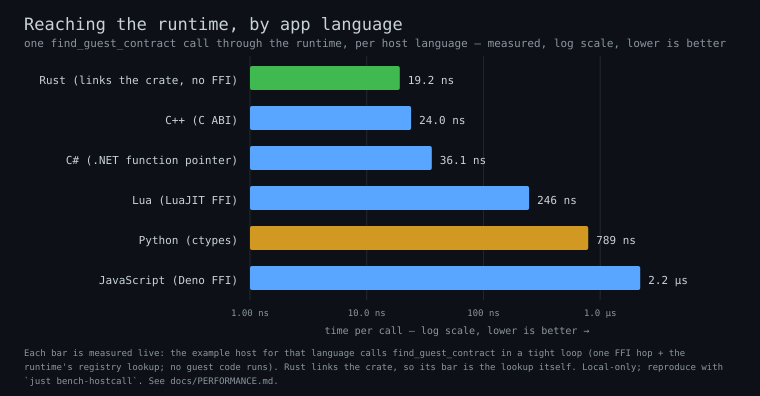

> **How this is measured.** `just bench-hostcall` (wrapping
> `examples/hosts/roundtrip_bench.sh --hostcall`) runs every example host with
> `POLYPLUG_BENCH_ITERS` set; each host times one `find_guest_contract` call per
> iteration through the runtime — one FFI hop plus the registry lookup, **no
> guest code runs** — and the chart above regenerates straight from that live
> run (there is no committed data file). The Rust bar has no FFI hop at all, so
> it is the registry lookup itself (it agrees with the core
> `registry/find_guest_contract` criterion bench, ~20 ns).

| Language | Mechanism | Call overhead (measured) | vs Rust (floor) |
|----------|-----------|--------------------------|-----------------|
| **Rust** | Links the crate (no FFI) | ~19 ns (the registry lookup itself) | 1.0x |
| **C++** | C ABI | ~24 ns | ~1.3x |
| **C#** | .NET function pointer | ~36 ns | ~1.9x |
| **Lua** | LuaJIT FFI | ~250 ns | ~13x |
| **Python** | ctypes | ~790 ns | ~41x |
| **JavaScript** | Deno FFI | ~2.2 µs | ~115x |

A Rust host is the floor: it links `libpolyplug` as a normal crate and calls its
methods directly, so there is **no FFI boundary to cross** — the only cost is the
operation itself. Every other language reaches the runtime through the C ABI.

> The **other** direction — the runtime *calling into* a plugin written in each
> language — is charted under
> [Calling into a plugin](#calling-into-a-plugin-guest-dispatch) below. These are
> different boundaries; don't compare a bar from one chart to a bar from the other.

### Why the Differences?

| Language | FFI Mechanism | Overhead Source |
|----------|---------------|-----------------|
| C++ | C ABI call | One indirect call through a `HostApi` field — near-native |
| C# | .NET function pointer | Managed → native transition per call |
| Lua | LuaJIT FFI | cdata call + 8-byte struct return + method-table lookup |
| Python ctypes | libffi + Python wrappers | Dynamic argument conversion per call |
| JavaScript | Deno FFI | Struct-returning calls are not V8 fast-call eligible |

---

## Language-Specific Optimization

### C++ (Optimal)

**Already zero-overhead:**
- `resolve_guest_contract` returns a raw interface pointer — no FFI on the hot path
- The pointer is cached by the caller and reused across calls
- Retire-not-drop keeps it valid for the runtime's lifetime

```cpp
// Setup (once): resolve the interface pointer
const GuestContractInterface* interface = rt.resolve_guest_contract(handle);

// Hot path - direct indirect call, zero FFI overhead
interface->functions[fn_id](args, out);
```

**Hot-reload safety:** re-`find_guest_contract` + `resolve_guest_contract` to
observe a swapped-in version; the previously resolved pointer stays valid (retired, not freed).

### Lua (Fast)

**LuaJIT FFI keeps the hot path compiled (~250 ns per runtime call measured —
the cdata call itself is near-native; the rest is the struct return and method
dispatch):**
- Module-level type caching (`InterfaceType`, `DispatchFnType`, and one cached
  `ffi.typeof` ctype per `HostApi` function pointer — string-based `ffi.cast`
  in a loop would exhaust LuaJIT's ctype table)
- Function pointer cache (`func_cache`)
- JIT-compiled calls

```lua
-- Setup (once): resolve the interface cdata pointer
local interface = rt:resolve_guest_contract(handle)

-- Hot path: dispatch through the cached interface
local result = interface:call(0, input)
```

**Hot-reload safety:** re-`find_guest_contract` + `resolve_guest_contract` to observe a swapped-in version.

### JavaScript / Deno (Slowest measured — cache aggressively)

**Deno FFI pays the most per runtime call (~2.2 µs measured — handle-returning
calls go through V8's slow path), so resolve once and reuse:**
- Module-level caches (`_funcCache`, `_DISPATCH_FN_TYPE`)
- `BigUint64Array` for fast interface reads
- `UnsafeFnPointer` for direct calls

```javascript
// Setup (once): resolve the interface view
const interface = rt.resolveGuestContractInterface(handle);

// Hot path: dispatch through the cached interface
const result = interface.call(0, input);
```

**Hot-reload safety:** re-`findGuestContract` + `resolveGuestContract` to observe a swapped-in version.

### Python (Acceptable)

**One hot path — ctypes:**

- **Overhead**: ~790 ns per call (measured, `just bench-hostcall`)
- **Requirements**: None (built-in)
- **Best for**: Plugin functions >10μs, where the overhead drops below ~8%

The SDK auto-selects a cffi backend when `cffi` is installed, but that backend
only wraps the **two** library exports (`polyplug_runtime_create` /
`polyplug_runtime_destroy`). Every per-call operation goes through cached
ctypes function pointers read from the `HostApi` struct, so installing cffi
does **not** change the per-call overhead.

```python
# Backend selection only affects create/destroy; the hot path is ctypes either way
from polyplug import Runtime

rt = Runtime()
interface = rt.resolve_guest_contract(handle)  # raw interface pointer
```

**Hot-reload safety:** re-`find_guest_contract` + `resolve_guest_contract` to observe a swapped-in version.

---

## Decision Matrix

### When to Use Each Backend

| Plugin Function Duration | Python host (~790 ns/call) | Other Languages |
|-------------------------|----------------------------|-----------------|
| < 1 μs (trivial) | ≥ 44% overhead | Use Rust/C++/C# |
| 1-10 μs (light) | 7-44% overhead | Any language OK |
| 10-100 μs (moderate) | 0.8-7% overhead | Negligible |
| > 100 μs (heavy) | < 0.8% overhead | Negligible |

> The percentages derive from the *measured* Python host-call overhead above
> (~790 ns per call, `just bench-hostcall`) — your hardware will shift the
> absolute numbers, not the shape.

### Language Selection Guide

| Use Case | Recommended Language | Reason |
|----------|---------------------|--------|
| Maximum performance | Rust or C++ | ~19-24 ns per runtime call (measured) |
| Game engines | C++ or Lua | LuaJIT keeps the hot path compiled (~250 ns/call) |
| Web backends | JavaScript (Deno) | Async support — but the FFI hop is the highest measured (~2.2 µs/call), so cache resolved pointers |
| Data science | Python | Ecosystem; ~790 ns/call is negligible for >10 µs functions |
| Scripting/embedded | Lua | Small footprint, fast FFI |

---

## Hot-Reload Safety Architecture

All host libraries implement the same hot-reload safety pattern:

```
┌─────────────────────────────────────────────────────────────────┐
│                  HOT-RELOAD SAFE RESOLUTION                       │
├─────────────────────────────────────────────────────────────────┤
│                                                                  │
│   resolve_guest_contract(handle) -> *const GuestContractInterface│
│   1. Validates the handle's generation against the slot          │
│   2. Returns the slot's current interface pointer                │
│                                                                  │
│   The caller MAY cache that pointer and reuse it, because:       │
│   - A hot-reload swaps the slot to the new interface, but        │
│   - the superseded interface is retired, not freed, so a         │
│     previously resolved pointer stays valid (keeps serving the   │
│     old version)                                                  │
│                                                                  │
│   To observe the NEW version after a reload, re-find +           │
│   re-resolve the handle.                                         │
│                                                                  │
└─────────────────────────────────────────────────────────────────┘
```

**Cache the pointer, or re-resolve — your choice.**

When hot-reload happens, the Rust runtime, under the `RuntimeStore` RwLock write guard:
1. Swaps the interface in the slot to the newly registered one (`apply_reload_swap`)
2. Pushes the superseded interface onto `retired_interfaces`

The retire-not-drop model keeps superseded interfaces alive for the runtime lifetime,
so a previously resolved pointer never dangles. This is the deliberate design choice
behind the benchmarks: there is **no per-call guard** and no forced re-resolve. A
long-lived caller resolves once and dispatches through the cached pointer at native
speed; it only re-`find_guest_contract` + `resolve_guest_contract` when it explicitly
wants to pick up a swapped-in version.

**Overhead:**

| Operation | Cost | Impact |
|-----------|------|--------|
| Cached interface pointer (the hot path) | ~2 ns dispatch | Keeps serving the version it resolved (valid via retire-not-drop) |
| Re-find + re-resolve | ~20-30 ns (`amortization/find_and_resolve` measures ~22 ns) | Picks up the swapped-in interface |

For typical plugin calls (>1µs), even an explicit re-resolve every call is <5%.

---

## Benchmarking

### Run Benchmarks

```bash
# Rust core (criterion)
cargo bench -p polyplug

# Loader crates (VM dispatch benches)
cargo bench -p polyplug_lua -p polyplug_js -p polyplug_python -p polyplug_dotnet

# Full measured cross-language matrix (every host × every guest)
just bench-roundtrip          # wraps examples/hosts/roundtrip_bench.sh

# Host-side FFI hop in isolation (refreshes cross_lang_host.svg)
just bench-hostcall           # wraps examples/hosts/roundtrip_bench.sh --hostcall
```

The non-Rust host-side FFI hop is measured **in isolation** by
`just bench-hostcall` — one `find_guest_contract` call per iteration in every
example host, no guest dispatch (see
[Reaching the runtime](#reaching-the-runtime-host-call-overhead)). The
**end-to-end** per-pairing numbers are the cells in the
[cross-language matrix](#call-cost-for-any-language-combination).

### Expected Results

> Methodology: criterion 0.8, `--release`, 100 samples/bench. The illustrative
> numbers here and below were taken on an AMD Ryzen 9 5900X (12-core) / 32 GiB
> Linux box. Re-run on your own quiet machine and trust **ratios**, not absolute ns.

**Rust core (`cargo bench -p polyplug`):**
```
ffi/resolve_plugin/direct_interface:    ~10 ns
ffi/find_all_by_contract/single_match:  ~46 ns   (allocates the result array)
registry/resolve:                       ~4 ns
registry/find_guest_contract:           ~20 ns
```

### The safety tax — polyplug vs raw FFI vs a direct call

The `counter_inc` bench (`cargo bench -p polyplug --bench counter_inc`)
answers the only question that matters for adoption: **what does polyplug's
safety actually cost on the hot path?** It runs the *identical*
one-million-iteration `counter = inc(counter)` loop through five mechanisms,
so each per-call number isolates exactly one cost. Arms 3–5 load the
*same* contract (`x + 1`); the only difference between the FFI arm and the
polyplug arms is polyplug's safety machinery, and the only difference between
the Rust and C++ polyplug arms is the plugin's source language.

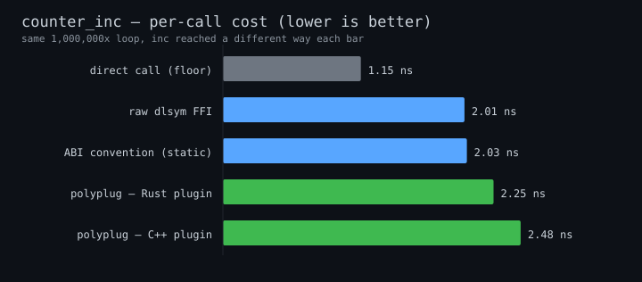

| Arm | Mechanism | ns/call | Throughput | vs floor |
|---|---|---|---|---|
| `native/inline_never` | direct Rust call, `#[inline(never)]`, no ABI boundary | ~1.1–1.5 ns | ~650–900 M/s | 1.0× (floor) |
| `ffi/by_value` | raw `dlsym` `extern "C" inc(u32)->u32`, by value | ~1.8–2.0 ns | ~500–550 M/s | ~1.5× |
| `native/abi_marshalled` | ptr-in / ptr-out ABI convention, **statically linked** | ~2.1 ns | ~480 M/s | ~1.6× |
| `polyplug/dispatch` | **resolved contract dispatch over a loaded Rust `.so`** | ~2.3 ns | ~430 M/s | ~1.8× |
| `polyplug/dispatch_cpp` | the same, dispatching a **C++**-authored plugin | ~2.5 ns | ~400 M/s | ~1.9× |

_(Numbers from one developer machine — treat the **ratios**, not the absolute
ns, as the result; they move with CPU but the ordering and gaps are stable. The
chart above is regenerated from the same run by `scripts/gen_bench_charts.py`.)_

**What the numbers say:**

- **polyplug's safe dispatch costs ~0.3–0.5 ns more than hand-rolled raw FFI**
  (~2.3 ns vs ~1.8–2.0 ns) — roughly a single L1 cache hit — for full type-checked
  registration, lifecycle management, hot-reload, and retire-not-drop safety.
- **Most of that gap is the calling convention, not dispatch.** The
  `abi_marshalled` arm pays 2.1 ns with *no dynamic library at all*: passing a
  struct by pointer and writing the result through an out-pointer is inherently
  a touch more than passing a `u32` in a register. Crossing the `.so` boundary
  on top of that adds only ~0.2 ns.
- Both FFI paths are within **~2×** of a function call the compiler is *forbidden
  to inline*. At **~430 million calls/second**, the safety boundary is free for
  any workload that does real work per call.

The honest framing: a *direct* call (arm 1) is genuinely cheaper — it has no
ABI boundary — and we don't claim parity with it. The real-world comparison is
"polyplug vs the raw, unsafe FFI you'd otherwise hand-write," and there the tax
is sub-nanosecond. The pessimal "re-resolve the contract on every call" pattern
(nobody does this in a loop) is measured separately by
`contract_dispatch::bench_dispatch_cross_plugin`.

**Where the overhead disappears entirely.** `counter_inc` deliberately uses the
cheapest possible payload (`x + 1`) to *expose* the fixed per-call cost. In a
real plugin the call does real work, and that fixed sub-nanosecond cost vanishes
next to it. The `payload_scaling` bench
(`cargo bench -p polyplug --bench payload_scaling`) proves it: it runs the
*same* byte-fill work natively and through polyplug across a sweep of payload
sizes. The two lines converge as the payload grows — by a few hundred bytes the
dispatch overhead is below measurement noise.

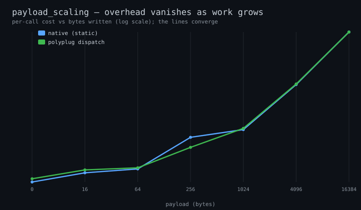

So the honest "real world" reading is: **on any call that does meaningful work,
the safety boundary is free.** The pessimal "re-resolve the contract on every
call" pattern (nobody does this in a loop) is measured separately by
`contract_dispatch::bench_dispatch_cross_plugin`.

> **Regenerating these charts.** All SVGs are committed under
> `docs/assets/benches/` and rebuilt locally — never in CI. Most are drawn from a
> criterion run; the guest-by-language chart reads every loader's bar live, so run
> the loader crates too:
> ```bash
> cargo bench -p polyplug -p polyplug_lua -p polyplug_js \
>     -p polyplug_python -p polyplug_dotnet            # produces target/criterion
> python3 scripts/gen_bench_charts.py target/criterion docs/assets/benches
> ```
> The one exception is the [cross-language matrix](#call-cost-for-any-language-combination),
> which is measured by running the host examples rather than criterion. Refresh it
> with `just bench-roundtrip` (it renders `cross_lang_matrix.svg` straight from the
> live run — no committed data file). Run benches on a quiet machine and trust the
> **ratios**, not the absolute ns.

---

## A full call and return (native round trip)

`counter_inc` above measures the simplest round trip — a Rust app, plugin already
looked up, calling `inc()` and reading a number back, ~2 ns/call. The picture
extends cleanly to calls that **return data**:

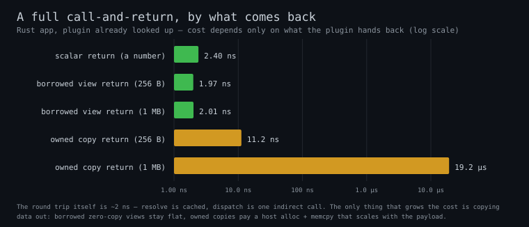

The round trip itself stays ~2 ns — the plugin is already looked up, and the call
is one jump. What grows the cost is **what comes back**:

- **a number, or a borrowed view** — flat ~2 ns, *regardless of size*. A borrowed
  view points straight at the plugin's own memory, so there is nothing to allocate
  or copy. (In each language that view is `&str`/`&[u8]` in Rust, `string_view`
  in C++, `ReadOnlySpan` in C#, `memoryview` in Python — see the
  [borrow-vs-copy](#returning-data-borrow-vs-copy) section.)
- **an owned copy** — a fresh allocation plus a byte-copy that grows with the
  payload (~12 ns at 256 B, climbing to ~20 µs at 1 MB).

So for a native app, "call a plugin and get data back" is ~2 ns plus the cost of
*owning* the result — and you only pay that when you ask for your own copy.

---

## Call cost for any language combination

The headline question: **if I write my app in language X and my plugin in language
Y, what does one call cost?** This grid measures every combination end to end —
each cell is one host language calling a plugin of one guest language, building the
argument, making the call, and reading the returned string back.

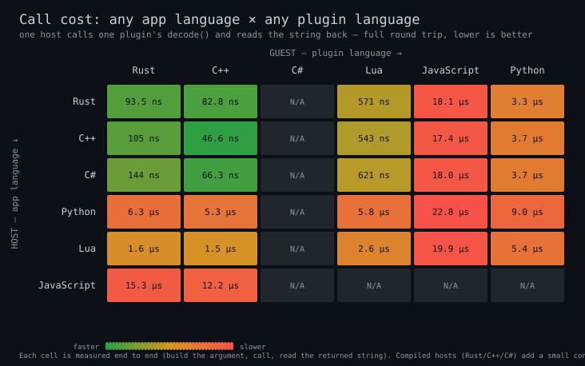

**How to read it:** rows are the **app** (host) language, columns are the **plugin**
(guest) language. Each cell is the time for one full call-and-return — greener is
faster, redder is slower (the scale spans nanoseconds to microseconds, so cells are
colored by order of magnitude). Find your app language down the left, your plugin
language across the top, and read the cell where they meet.

What the grid shows:

- **The app language sets the floor.** Compiled apps (Rust / C++ / C#) add only a
  small constant per call; scripted apps (Lua / Python / JS) pay their own per-call
  marshalling, which dominates everything else in the row.
- **A native plugin (Rust / C++) is the fastest column** — a direct call with no
  language VM. Lua / JS / Python plugins add their interpreter's cost on top.
- **The two effects stack.** A Rust app calling a Rust plugin is the green corner;
  the scripted-app rows are the red end. Most real setups land in between, and the
  grid tells you exactly where.

Every one of the 36 pairings is measured — all six app languages (Rust / C++ /
C# / Lua / Python / JS) against all six plugin languages, with no gaps.

- **A C# app loading a C# plugin reuses the host's own .NET runtime.** A native
  app (Rust / C++ / …) loads a C# plugin by spinning up a .NET runtime through the
  loader; a C# app already *is* a .NET process, so the loader loads the plugin into
  the runtime that's already there instead of starting a second one. That's the
  `csharp × C#` cell — a normal in-process call, no extra runtime.

> This grid measures the **whole** call (argument in, call, string back), so its
> numbers are larger than the single-boundary charts above — the
> [reaching-the-runtime](#reaching-the-runtime-host-call-overhead) chart isolates
> one bare FFI call, and [calling-into-a-plugin](#calling-into-a-plugin-guest-dispatch)
> isolates one dispatch. This grid is both of those plus the string return, for
> every pairing. All three are honest; they just measure different slices.

Reproduce locally with `just bench-roundtrip` (or
`examples/hosts/roundtrip_bench.sh`): for each guest language it builds a
single-language plugin set, runs every available host against it in a timed loop,
and renders `cross_lang_matrix.svg` directly — there is no committed data file, the
chart is regenerated from the live run.

---

## Optimization Tips

### 1. Batch Operations

Instead of multiple FFI calls:
```python
# Bad: Multiple FFI calls
for contract_id in contract_ids:
    handle = rt.find_guest_contract(contract_id, 1)

# Good: Single FFI call
handles = rt.find_all_by_contract(contract_id, 1)
```

### 2. Resolve once, reuse the interface pointer

```python
# Bad: Resolve on every call
for data in dataset:
    interface = rt.resolve_guest_contract(handle)
    result = call_plugin(interface, data)

# Good: Resolve once, call many times (the pointer stays valid — retire-not-drop)
interface = rt.resolve_guest_contract(handle)
for data in dataset:
    result = call_plugin(interface, data)
```

### 3. Choose the Right Language

For hot paths called millions of times (measured host-call overheads — see
[Reaching the runtime](#reaching-the-runtime-host-call-overhead)):
- C++: ~24 ns per runtime call
- Python (ctypes): ~790 ns per runtime call
- Difference: ~33x

If your hot path is truly performance-critical, write the host in Rust, C++,
or C#.

---

## Returning data: borrow vs copy

When a plugin hands data back, there are two ways to do it, and they cost very
different amounts:

- **Borrow it (zero-copy).** The plugin returns a *view* that points straight at
  its own memory — nothing is allocated, nothing is copied. This is **flat ~2 ns
  no matter how big the data is**, because the bytes never move.
- **Copy it (owned).** The plugin allocates fresh memory and copies the bytes in,
  so the caller gets its own independent copy. That allocation + byte-copy **grows
  with the size** — cheap for a few bytes, real work for a megabyte.

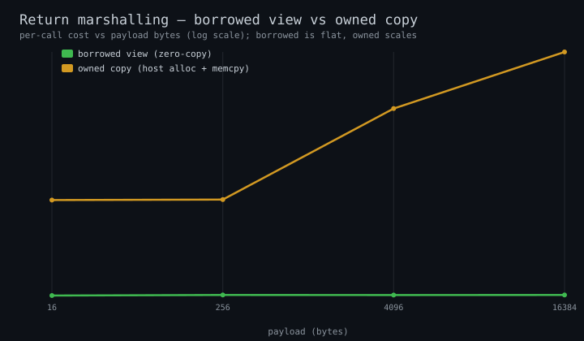

The borrowed line is flat across the whole sweep (16 B → 1 MB); the owned line
climbs with the payload. Borrowed views are the default for returns in every
language — you only pay the copy cost when you explicitly ask to own the data.

### "Borrowed view", in each language

A *borrowed view* is the same idea — a pointer + length aliasing the plugin's
bytes — surfaced as each language's own zero-copy type. There are two underlying
ABI shapes: `StringView` for UTF-8 text and `Buffer` for raw bytes. They are not
six different things; they are one borrow, named six ways:

| ABI shape | Rust | C++ | C# | Python | JavaScript |
|---|---|---|---|---|---|
| `StringView` (UTF-8 text) | `&str` | `std::string_view` | `ReadOnlySpan<byte>` | `memoryview` | `Uint8Array` view |
| `Buffer` (raw bytes) | `&[u8]` | `span` / pointer+len | `ReadOnlySpan<byte>` | `memoryview` | `Uint8Array` view |

> **`memoryview` vs `Buffer` are not two different costs.** `Buffer` is the
> ABI-level type (a pointer + length); `memoryview` is simply *Python's* zero-copy
> window onto that same `Buffer`. Same memory, no copy — just Python's name for
> borrowing it. The cost is the flat "borrowed" line above, in every language.

The mechanism that lets *VM* plugins (JS / Lua) return data with the same
zero-allocation property is the **call arena**, below.

---

## Call Arena (zero-allocation returns for VM guests)

### What it is

A `CallArena` is a small per-call **bump allocator** the host hands to a VM
dispatch call. The guest writes its variable-size return values (strings,
arrays) into the arena's region instead of calling `host->alloc` once per value.
The arena is a 40-byte `#[repr(C)]` struct: a primary `[base, end)` bump region
(an inline buffer owned by the caller) plus a fallback chain of host-allocated
overflow blocks for returns larger than the primary region.

The host caller **resets** the arena at the start of each call (a single pointer
rewind, freeing any overflow blocks in one pass). So after a warmup phase the
common case — a small string return — is served entirely from the bump region
with **zero host allocations**.

### Why it matters

Without the arena, every dispatch call that returns a string does one
`host->alloc` + one `host->free` per value. The arena turns the steady-state
return path into a pointer increment, removing the allocator round trip from hot
dispatch loops. For a 10,000-iteration echo loop the integration tests assert the
host allocator is hit **zero** times after warmup.

This is what gives *VM* plugins the same flat, zero-allocation return cost shown in
[Returning data: borrow vs copy](#returning-data-borrow-vs-copy) above: native
plugins borrow their own memory directly, and the arena lets a JS or Lua plugin
write its return into a caller-owned region instead of allocating per value.

### Lifetime rule

> A view returned from an arena-backed call is valid **until the next
> arena-backed call on the same caller.**

The caller resets the arena at the start of each call, which invalidates the
previous call's arena allocations. Guests **never free** arena memory — the
arena owns it and reclaims it on reset. If you need a return value to outlive the
next call, copy it out, or use the explicit `alloc`/`free` path instead of the
arena helper.

### Which paths use it

| Path | Uses arena? | How |
|---|---|---|
| JS (QuickJS) guest returns | Yes | `polyplug.arenaAlloc` bridge → `allocStringArena` in the guest SDK |
| Lua (LuaJIT) guest returns | Yes | `_polyplug_arena_alloc` bridge → `alloc_string_arena` in the guest SDK |
| Rust host callers | Yes | per-caller `CallArena` field threaded into VM dispatch when a return needs it |
| Native Rust / C++ / C# guest returns | N/A | returns are already **borrowed zero-allocation views** into guest-owned memory — nothing to allocate, so no arena is needed |
| Python (CPython) guest returns | Yes | Python guests register **`DispatchType::VirtualMachine`** (`polyplug_python` loader); the `_polyplug_arena_alloc` bridge injected into the plugin module writes returns into the per-call arena |

### Null-arena fallback

The VM dispatch ABI signature is always
`call(loader_data, instance, fn_id, args, out, arena)`. Passing a **null arena**
means "no arena": the guest bridge (`arenaAlloc` / `_polyplug_arena_alloc`) falls
back to per-value `host->alloc`. Host callers that cannot hold a per-caller arena
(e.g. the Lua/Python guest-side host-contract callers) pass null and remain
correct — just not zero-allocation. Every loader passes the arena slot, so the
signature is uniform across all languages.

### Measured arena costs

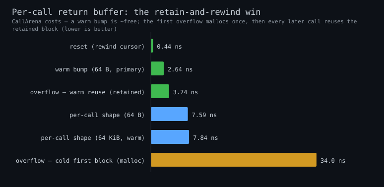

The `call_arena` microbench (`cargo bench -p polyplug --bench call_arena`) reads
every bar live from criterion. Measured locally:

| Path | ~cost (local) | what it shows |
|---|---|---|
| `reset/primary_only` | ~0.45 ns | a `reset()` with no overflow is just a cursor rewind — effectively free |
| `primary/alloc_64` | ~2.7 ns | a warm bump inside the primary region (align + add) |
| `overflow/warm_reuse` | ~3.4 ns | an overflowing alloc that **reuses the retained block** — no host call |
| `per_call/64`, `per_call/65536` | ~7.6 ns, ~7.8 ns | a realistic header + payload + trailer at primary and overflow sizes |
| `overflow/cold_first_block` | ~34 ns | the **first** overflow — pays a host `malloc` |

The headline is `overflow/cold_first_block` (~34 ns) **vs** `overflow/warm_reuse`
(~3.4 ns): the ~10× gap is exactly what **retain-and-rewind** buys — after the
first call that overflows, `reset()` retains the host-allocated block and every
later call reuses it instead of mallocing again. That `per_call/65536` (64 KiB
payload) sits right next to `per_call/64` (rather than 10× higher) is the same
win in the realistic per-call shape.

---

## VM Loader Performance

### JavaScript/QuickJS Guest Plugins

QuickJS guest plugins use a cached Context architecture for minimal dispatch overhead:

```
┌─────────────────────────────────────────────────────────────────┐
│                 QUICKJS DISPATCH ARCHITECTURE                    │
├─────────────────────────────────────────────────────────────────┤
│                                                                  │
│   Bundle Load (one-time):                                        │
│   1. Create QuickJS Runtime (per-bundle, owned by JsLoaderData) │
│   2. Create Context for this bundle                             │
│   3. Evaluate bundle JS, extract interface                       │
│   4. Store Runtime + Context + Persistent<Function> in LoaderData│
│                                                                  │
│   Dispatch Call (hot path):                                      │
│   1. data.ctx.with(|ctx| { ... })     // Reuse cached Context   │
│   2. func.clone().restore(&ctx)       // ~10-50 ns              │
│   3. func.call(args)                  // JS execution           │
│                                                                  │
│   Total overhead: ~80–100 ns warm (cached_context_single_call,  │
│   excluding JS execution time)                                  │
│                                                                  │
└─────────────────────────────────────────────────────────────────┘
```

#### Benchmark Results

The canonical QuickJS numbers (one table, quoted everywhere) live in the
[QuickJS guest-dispatch table](#quickjs-js-guest-plugins) under
*Calling into a plugin* below: **~80–100 ns** per warm single dispatch
(`cached_dispatch/cached_context_single_call`), amortizing to **~70 ns/call**
over a 10-call batch (`cached_context_10_calls`).

#### Why This Is Minimal Overhead

The ~80–100 ns warm overhead is close to the floor for QuickJS dispatch:

| Component | Time | Description |
|-----------|------|-------------|
| `ctx.with()` scope entry | ~10 ns | Enter QuickJS context |
| `Persistent::clone()` | ~10-20 ns | Clone the persistent reference |
| `restore(&ctx)` | ~30-50 ns | Restore JS function in context |
| JS function call overhead | ~10-20 ns | QuickJS internal dispatch |
| **Total** | **~80–100 ns measured** | components are estimates; the total is the measured arm |

This overhead cannot be eliminated because:
1. QuickJS requires a context scope for any JS operation
2. `Persistent<Function>` must be restored to the current context
3. The JS function call itself has minimal QuickJS overhead

#### Per-Bundle Runtime Isolation

Each bundle gets its own QuickJS Runtime stored in `JsLoaderData`. This ensures:
- Complete isolation between bundles
- Complete isolation between polyplug Runtime instances
- Tests can run in parallel without state pollution
- No shared global state between different plugin bundles

#### Comparison with Other VM Loaders

See the canonical [Summary table](#summary) under *Calling into a plugin*
below — all loaders, one table, no duplicate copies to drift.

---

## Calling into a plugin (guest dispatch)

This is the **runtime → plugin** direction: how much it costs the runtime to
*run* a plugin written in each language. (The technical name is "guest dispatch."
The reverse direction — your app calling into the runtime — is
[Reaching the runtime](#reaching-the-runtime-host-call-overhead) far above. And the *whole* call, for every language pairing, is the
[cross-language matrix](#call-cost-for-any-language-combination).)

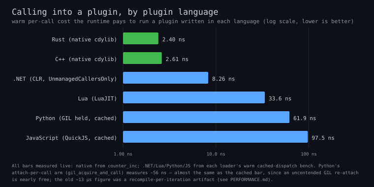

**Every bar is read live from criterion** — native from the `counter_inc` run,
and each VM from its loader's warm steady-state dispatch bench below (`.NET`
`clr_init_call`, `lua` `vm_dispatch_single_call`, `python` `cached_python_single_call`,
`js` `cached_context_single_call`). Native dispatch is **language-blind**
(~2.3–2.5 ns whether the plugin is Rust or C++); each VM then adds its own
interpreter cost on top.

> **All numbers below are from actual benchmark runs on the current codebase.**
> Run `cargo bench -p polyplug --bench contract_dispatch`, `cargo bench -p polyplug_js`, etc. to reproduce.

### Native (Rust/C++/NativeAOT Guest Plugins)

| Benchmark | Time | Description |
|-----------|------|-------------|
| `noop` | **~2 ns** | Trivial function call (add(0,0)) |
| `struct_arg_and_return` | **~2 ns** | Struct args with return value |
| `buffer_arg` | **~30 ns** | 4096-byte buffer operation |
| `cross_plugin` | **~35 ns** | find_guest_contract + resolve + dispatch |

**Native dispatch is essentially zero overhead** - direct function pointer calls with no VM layer.

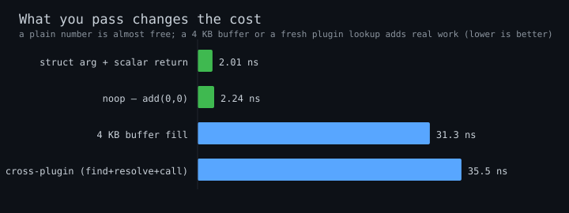

Scalar args (`noop`, `struct_arg_and_return`) are ~free; the cost only shows up
when there is real work — filling a 4 KB buffer, or a cross-plugin call that pays
a `find_guest_contract` + `resolve_guest_contract` registry lookup before dispatch.

### QuickJS (JS Guest Plugins)

| Benchmark | Time | Description |
|-----------|------|-------------|
| `cached_context_single_call` | **~80–100 ns** | Single warm dispatch with cached Context — the canonical QuickJS per-call figure |
| `cached_context_10_calls` | ~670–730 ns | 10 calls (~70 ns/call amortized) |

### Lua (LuaJIT Guest Plugins)

| Benchmark | Time | Description |
|-----------|------|-------------|
| `vm_dispatch_single_call` | **34-37 ns** | VM dispatch via mlua |
| `vm_dispatch_10_calls` | 339-382 ns | 10 calls (~34-38 ns/call) |
| `cached_function_single_call` | **33 ns** | Cached function dispatch |
| `cached_function_10_calls` | 328-371 ns | 10 cached calls (~33-37 ns/call) |
| `create_unsafe_vm` | 85-99 µs | One-time VM creation cost |

**Lua is the fastest VM loader** - LuaJIT's FFI provides near-native performance.

### Python (CPython Guest Plugins)

| Benchmark | Time | Description |
|-----------|------|-------------|
| `gil_acquire_and_call` | **~56 ns** | `Python::attach` (re-acquire the GIL on a thread not holding it) **+ one cached `noop_dispatch` call** — the cost of attaching fresh per call |
| `gil_acquire_and_10_calls` | ~272 ns | Same attach, 10 cached calls inside it (~27 ns/call once the attach is amortized) |
| `gil_acquire_only` | ~35-37 ns | GIL acquisition alone |
| `cached_python_single_call` | **~60 ns** | Cached function, single attach held across the call |
| `cached_python_10_calls` | ~278 ns | 10 cached calls under one attach (~28 ns/call) |

> The Python warm-dispatch arm is named `cached_python_*` (not `cached_function_*`)
> so it does not collide with the Lua bench's identically-grouped `cached_function_*`
> — both write to the shared `cached_dispatch` criterion group, and a shared id would
> overwrite the other loader's data.

**Correction — the "GIL costs ~13 µs" number was a benchmark bug, now fixed.**
Earlier revisions of this table quoted `gil_acquire_and_call` at ~12-14 µs and
called the discrepancy "under investigation". The cause is now known and
repaired: that arm *re-defined its Python function from source (`py.run`) inside
`b.iter()` on every iteration*, so it timed **Python source compilation**, not
GIL-acquire + dispatch — the entire ~13 µs was the compiler. The bench now
compiles `noop_dispatch` exactly **once** before the timed loop (caching a
`Py<PyAny>`) and measures only `attach` + `call`. The honest result:

- **attach-per-call (`gil_acquire_and_call`) ≈ ~56 ns**, almost identical to the
  cached fast path (~60 ns) — because an *uncontended* GIL re-attach is nearly
  free, so the dominant cost is the Python function call itself, not the GIL.
- The gap the old myth implied (a multi-µs "GIL tax") **does not exist** on this
  path; warm Python guest dispatch is ~56-60 ns, and batching many calls under
  one attach amortizes the attach to ~27-28 ns/call.

### .NET (CLR Guest Plugins)

| Benchmark | Time | Description |
|-----------|------|-------------|
| `clr_init_call` | **~7-11 ns** | Real CLR dispatch via `[UnmanagedCallersOnly]` (varies with machine load) |
| `clr_init_10_calls` | 70-115 ns | 10 calls (~7-11 ns/call) |
| `native_function_pointer_call` | 1.3-1.5 ns | Native baseline for comparison |

**.NET dispatch is near-native** - only ~5x slower than a native function pointer call. The `[UnmanagedCallersOnly]` attribute exposes native function pointers from the CLR, enabling zero-overhead interop.

### Summary

| Loader Type | Dispatch Overhead | Best For |
|-------------|-------------------|----------|
| **Native** | ~2 ns | Maximum performance |
| **.NET** | ~7-11 ns | Near-native with CLR ecosystem |
| **Lua** | ~35 ns | Fastest VM dispatch, embedded scripting |
| **QuickJS** | ~80–100 ns (`cached_context_single_call`) | Fast VM dispatch, JS ecosystem |
| **Python** | ~56-60 ns (cached, GIL held; attach-per-call is within a few ns) | Data science, ML ecosystem |

### Performance Insights

1. **Native is zero overhead** - Direct function pointer calls
2. **.NET is near-native** - `[UnmanagedCallersOnly]` enables ~7-11 ns dispatch through CLR
3. **Lua is the fastest VM loader** - LuaJIT's FFI provides ~35 ns dispatch
4. **QuickJS follows closely** - ~80–100 ns with cached context architecture
5. **Python warm dispatch is ~56-60 ns** - attach-per-call (`gil_acquire_and_call`, ~56 ns) is within a few ns of the cached fast path; an uncontended GIL re-attach is nearly free. (The old ~12-14 µs figure was a recompile-per-iteration bug in the bench, now fixed.)
6. **All VM loaders are "fast enough"** - even the slowest VM dispatch here (~60-100 ns) is negligible for functions >100 µs

---

## Calling back into the host (guest → host)

Everything above measures host → guest (running a plugin) and guest → guest
(`cross_call`). The reverse direction — a guest calling a **host-registered
contract** or emitting a log into the host — is measured by the
`guest_host_call` core bench (`cargo bench -p polyplug --bench guest_host_call`).
Both arms drive the real `HostApi` callbacks on a real `Runtime` (a hand-built
native `HostContractInterface`, no bundle required):

| Arm | What it measures | ~cost (local) |
|---|---|---|
| `host_contract_call/native` | Guest resolves the host interface **once** (real `HostApi.resolve_host_contract_interface`), then dispatches its native function — the path a generated guest-side host caller bottoms out in | **~1.8 ns** |
| `host_log/delivered` | One **delivered** log record through the `RuntimeConfig.log` funnel: level filter → message build → `StringView` construction → the installed `extern "C"` callback → boxed sink | **~6.9 ns** |

The host-contract call is the native dispatch floor (~1.8 ns — one cached
indirect call, same as any resolved native dispatch). The log funnel is ~6.9 ns
*per delivered line* and is paid **only** for records that pass `log_max_level`;
filtered levels are a near-free early return and the dispatch hot path never
touches the logger at all.

> **Per-language host→log trampolines.** A LuaJIT host cannot receive the
> by-value `StringView`s of `RuntimeConfig.log`, so the Lua loader exports
> `polyplug_lua_log_trampoline` to bridge them to a scalar callback. Its
> **Rust-side** cost (bridge read + StringView decomposition + indirect call) is
> ~2.5 ns (`lua_log/trampoline_delivery` in the Lua loader bench). The *full* Lua
> path — including the LuaJIT-callback transition and two `ffi.string` copies into
> a user Lua function — is ~255 ns/line, measured by the `POLYPLUG_BENCH_ITERS`
> arm in `sdks/lua/host/tests/test_log_runtime.lua` (the trampoline itself is a
> rounding error; the cost is the VM crossing).

### Guest → guest peer calls

The `cross_call` bench now carries a second arm, `peer/stateless_route`, next to
`native/single_provider`. It measures the runtime path a generated **peer caller**
(guest contract → another guest contract) bottoms out in: a stateless instance
(null `data`, target `contract_id`) dispatched through `HostApi.call_guest_method`,
routed solely by `contract_id`. It lands at ~25 ns — **identical** to the
host-mediated cross-call — because they share the same `host_call_guest_method`
resolve chain (count + find + resolve). The honest takeaway: at the runtime level
a peer call costs the same as a host-mediated cross-call; any extra a real peer
caller pays is its language's marshalling, not the dispatch. (The per-language
generated marshalling cannot be measured in-process without a per-language bundle
— the same two-tier caveat as the dispatch matrix.)

---

## One-time setup costs (paid once)

Everything above is the **per-call** cost. The setup costs — loading a plugin,
looking it up, hot-reloading — happen *once* and are then spread across every
later call, so they never touch the hot path. (The technical name for "spread a
one-time cost across many calls" is *amortization*; that's what the `amortization`
bench measures.)

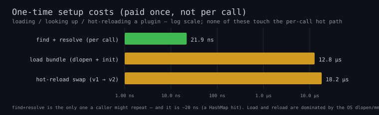

- **look up a plugin (~20 ns)** is the only one a caller might repeat — and it is a
  `HashMap` lookup plus a pointer read. Look it up once and reuse the result (see
  [Optimization Tips](#optimization-tips)) and even this disappears from the loop.
- **load a plugin (~13 µs)** and **native hot-reload swap (~17 µs)** are dominated
  by the operating system loading the shared library (`dlopen`/`mmap`), not by
  polyplug code — a flamegraph of the load path shows our own frames under 1% (see
  [PROFILING.md](./PROFILING.md)). The only lever is doing *fewer* loads, which the
  retire-not-drop model already does.

### VM-loader hot-reload (Lua + QuickJS)

Native is not the only reloadable tier — the **Lua** and **QuickJS** loaders also
support hot-reload, each measured by a reload arm in its loader-crate bench
(`cargo bench -p polyplug_lua --bench dispatch_benchmark lua_reload` /
`-p polyplug_js … js_reload`). Each builds a `Runtime` with the loader registered
and `hot_reload_enabled`, loads a path-backed bundle, then times `reload_bundle`.
Measured locally:

| Loader | `hot_reload_swap` ~cost (local) |
|---|---|
| native (cdylib) | ~17 µs |
| Lua (LuaJIT) | ~107 µs |
| QuickJS | ~158 µs |

The VM reloads cost more than native because the swap rebuilds and re-evaluates
the interpreter's per-bundle state, not just an `mmap` + symbol lookup. Like every
one-time cost they amortize away — a ~107 µs Lua reload spread over *N* later
dispatches contributes `107 µs / N` per call — and the value is the **capability**
(swap a plugin's code without restarting), not the µs.

### First call is cold; steady state is warm

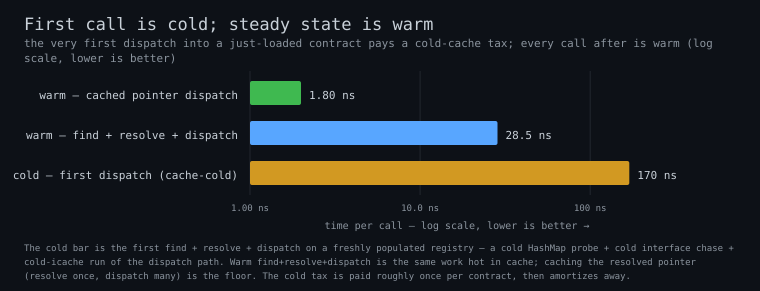

The `cold_start` bench separates the **first** dispatch into a just-registered
contract (everything cache-cold) from the warm steady state. Measured locally: the
first find + resolve + dispatch costs ~143 ns (a cold `HashMap` probe + cold
interface chase + cold-icache dispatch); the same path hot in cache is ~27 ns; and
the cache-the-handle hot path (resolve once, dispatch many) is the ~1.8 ns floor.
The cold tax is paid roughly **once per contract** on its very first call, then
amortizes away — and the [registry scale sweep](../crates/polyplug/benches/README.md#ffi_resolve--hostapiresolve_guest_contract)
shows resolve stays flat (~9.7 ns) whether 10 or 1000 contracts are registered, so
the cold cost does not grow with how many plugins a host has loaded.

## Load → unload churn soak (retire vs reclaim, and a leak this surfaced)

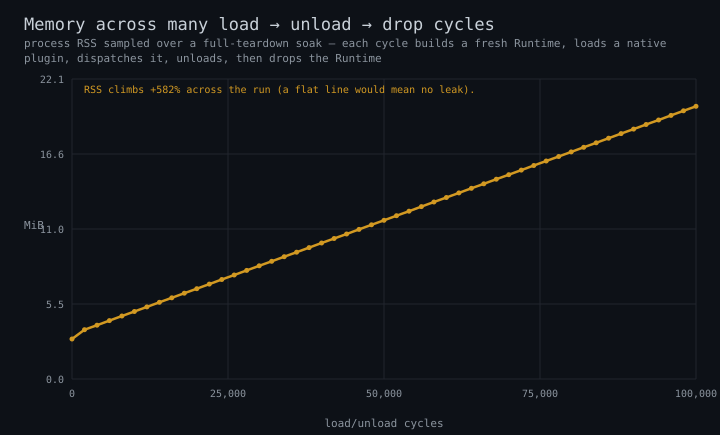

The microbenches above all measure *latency*. The **soak** measures *memory over
time*: an env-gated harness
([`crates/polyplug/tests/soak_load_unload.rs`](../crates/polyplug/tests/soak_load_unload.rs),
gated behind `POLYPLUG_SOAK_ITERS`) runs many full **load → dispatch → unload →
drop** cycles and samples process RSS, to prove the runtime does not leak across
bundle churn.

### Retire-not-drop vs reclaim — read this before reading the chart

polyplug uses a **retire-not-drop** model. Within a **single live `Runtime`**,
unloading or hot-reloading a bundle *retires* the superseded interface + library
— it keeps them mapped for the runtime's lifetime so any raw pointer a caller
already resolved stays valid (see "Resolve once, reuse the interface pointer"
above). So a loop that loads and unloads inside *one* long-lived runtime is
**expected** to grow RSS — that retained growth is by design, not a leak.
**Reclaim** of retired memory happens at **`Runtime` teardown** (`Drop`), and for
.NET via the collectible-ALC reclaim path. The honest leak test therefore tears
the whole runtime down every cycle: each iteration builds a *fresh* `Runtime`,
loads, dispatches, unloads, then **drops the runtime fully** (dropping the loader,
which `dlclose`s its libraries). Under full-teardown cycling, RSS must return to a
flat baseline — a rising line means a true leak.

### Measured (one developer machine, this run)

Run the soak:

```bash
cargo build --release -p polyplug --tests
POLYPLUG_SOAK_ITERS=100000 POLYPLUG_SOAK_SAMPLE_EVERY=2000 \
  POLYPLUG_SOAK_OUT=$PWD/target/soak/soak_rss.txt \
  cargo test --release -p polyplug --test soak_load_unload -- \
  --nocapture --exact soak_load_unload_churn
python3 scripts/gen_bench_charts.py --soak target/soak/soak_rss.txt \
  target/criterion docs/assets/benches
```

- **Churn throughput:** ~17,500–18,600 full load→dispatch→unload→drop cycles/sec
  (100,000 cycles in ~5.4–5.7 s across runs).
- **RSS series:** climbs **linearly** from ~3.1 MiB to ~20.6 MiB over 100,000
  cycles — slope ~0.17 KiB/cycle, **constant** across the first and second halves
  (no plateau). That straight-line, non-decaying growth under *full teardown* is a
  real leak signal, not allocator/`dlclose` retention.

### Leak found (flagged, not fixed here — out of bench scope)

The soak surfaced a genuine **core leak in the `Runtime` lifecycle**, ~168 bytes
per runtime built-and-dropped. It is **not** in load, unload, dispatch, or the
`dlopen`/`dlclose` machinery (a build-and-drop-only bisection leaks at the same
slope; a pure `dlopen`+`dlclose` loop with no runtime is flat). Root cause:
`RuntimeBuilder::build` does `Box::leak(Box::new(HostApi { … }))` to obtain the
`&'static HostApi` the FFI requires, and there is **no `impl Drop for Runtime`**
that reclaims it — `Arc<Runtime>` teardown frees the `Runtime` but not the leaked
`HostApi` (168 bytes, matching the observed per-cycle growth). A long-running host
that creates and destroys many short-lived runtimes (or repeatedly calls
`polyplug_runtime_create` / `polyplug_runtime_destroy`) leaks one `HostApi` per
runtime. **This is filed for a core fix; the bench task does not touch core.** The
chart shows the leak (a rising amber line) on purpose — once the core fix lands and
reclaims the `HostApi` at teardown, the same soak should redraw it flat (green).

The default `cargo test` run of this harness uses a tiny built-in cycle count
(env unset), so it stays fast and green and does not assert flatness — it is a
diagnostic, not a regression gate, until the leak is fixed.

## See Also

- [Profiling Guide](./PROFILING.md) — flamegraph any hot path locally
- [Benchmark Suite](../crates/polyplug/benches/README.md) — what each bench measures + chart regen
- [ABI Architecture](./ABI_ARCHITECTURE.md)
- [ABI Types](./abi_types.md)
- [Python host SDK](../sdks/python/host/)
- [C++ host SDK](../sdks/cpp/host/)
- [Lua host SDK](../sdks/lua/host/)
- [JavaScript host SDK](../sdks/js/host/)