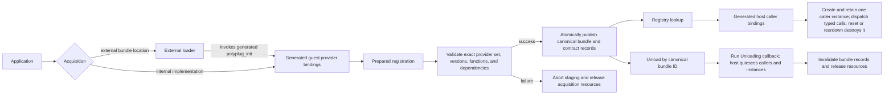

# How polyplug works

Polyplug gives an application one plugin pipeline. An application may acquire an
**external plugin** from a bundle location, or it may supply an **internal plugin**
as an implementation compiled into the application. That distinction ends before
registration: after registration, the registry, generated callers, dispatch, and
lifecycle operations use the same canonical bundle and contract records.

An external plugin is acquired from a bundle directory or another supported
`BundleSource`; its code and manifest are supplied by the external loader path. An
internal plugin is an application implementation exposed through the opt-in generated
guest provider bindings. Both are plugins, not separate registry models.

## The canonical pipeline



### Text equivalent

1. The application gives Polyplug either an external bundle location or an internal
   implementation.
2. An external loader acquires and checks an external bundle, then invokes its generated
   guest provider bindings through `polyplug_init` to stage ABI-facing provider descriptors.
   Generated guest provider bindings also adapt an internal implementation to those descriptors.
3. Each acquisition route stages the same prepared registration. Validation requires
   the declared provider set to match exactly and checks versions, function shapes, and
   declared dependencies.
4. A successful transaction atomically publishes canonical bundle and contract records;
   a failed transaction publishes nothing and releases the resources acquired for that
   attempt.
5. Generated host caller bindings resolve the published contract and create one
   caller-owned instance. That caller retains the instance across typed method calls;
   reset or caller teardown destroys it.
6. The runtime invokes its `Unloading` callback before invalidating a bundle. The
   application uses that boundary to quiesce the bundle's callers and instances; only
   then does Polyplug invalidate the affected records and release acquisition resources.

The diagram deliberately has no origin branch after prepared registration. Origin can
remain available for diagnostics, while `reload_bundle` is loader-backed and
external-only. Replacing an internal plugin is host quiescence followed by unload and
fresh generated registration, not `reload_bundle`.

## Roles and boundaries

| Role | Responsibility |
|---|---|
| Application | Chooses what to acquire, supplies bundle locations or internal implementations, applies its own enablement policy, and retains the returned canonical bundle ID for lifecycle actions. |
| `Runtime` | Coordinates acquisition, validation, prepared registration, publication, contract discovery, callers, and lifecycle. |
| External loader | Owns external artifact access and loader-specific checks before canonical registration. |
| Generated guest provider bindings | Provide the typed author surface and private ABI adaptation: an external bundle exposes `polyplug_init`; an internal implementation registers through its generated registrar. |
| Generated host caller bindings | Expose typed callers to application code after the registry resolves a contract. |
| Registry | Holds canonical bundle and contract records; it has no application-facing origin split. |

Polyplug owns ABI conversion, provider descriptors, interface records, staging, and
rollback. Application code owns its external locations, its internal implementation
objects before registration, and policy decisions. The acquisition adapter owns its
backing resources until the runtime has successfully taken the required ownership;
failed attempts release resources exactly once.

## Optional internal plugin profile

Internal plugins are optional. The default generation profiles remain distinct:

```text
polyplugc generate --api api.toml --lang rust --out generated/host
polyplugc generate --bundle bundle.toml --lang rust --out generated/guest
```

The first produces generated host caller bindings; the second produces the ordinary
external guest output. An application that needs an internal plugin explicitly selects
the combined profile for one bundle:

```text
polyplugc generate --bundle bundle.toml --internal --lang rust --out generated
```

The internal profile emits matching guest provider and host caller bindings under a
bundle-identity namespace such as `internal/<bundle-name>-<bundle-id>/`. It is opt-in,
so an external-only application does not need guest provider bindings or an internal
registration call.

## Read the pipeline in detail

- [Overview](overview.md) — the public model and complete pipeline.
- [Generated bindings](generated-bindings.md) — generated guest provider and host caller roles.
- [Acquisition](acquisition.md) — external loader and internal implementation inputs.
- [Registration](registration.md) — prepared staging, validation, publication, and rollback.
- [Registry and calls](registry-and-calls.md) — resolution, callers, instances, and dispatch.
- [Lifecycle](lifecycle.md) — reload capability, unload, invalidation, and ownership release.
- [Application integration](application-integration.md) — application and CheatGear usage.

The remaining pages use these terms consistently: **internal plugin**, **external
plugin**, **generated guest provider bindings**, and **generated host caller bindings**.
